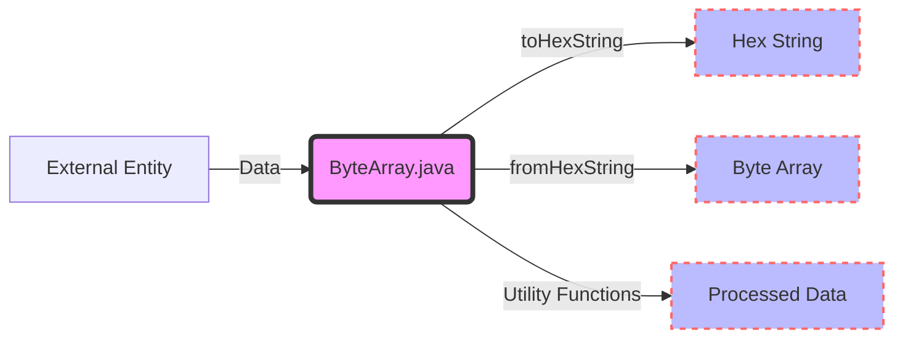

## Module: ByteArray.java
**模块名称**：ByteArray.java

**主要目标**：提供与字节数组相关的一系列实用功能，包括字节转换、数据格式转换以及与字符串和数值类型之间的互相转换等。

**关键功能**：
- `toHexString(byte[] data)`：将字节数组转换为十六进制字符串。
- `fromHexString(String data)`：从十六进制字符串获取字节数据。
- `toLong(byte[] b)`、`toInt(byte[] b)`：将字节数组转换为长整型和整型。
- `fromString(String s)`、`toStr(byte[] b)`：字符串与字节数组之间的转换。
- `fromLong(long val)`、`fromInt(int val)`：长整型和整型转换为字节数组。
- `fromObject(Object obj)`：从对象获取字节数据。
- `toJsonHex(byte[] x)`：将字节数组转换为JSON格式的十六进制字符串。
- `subArray(byte[] input, int start, int end)`：生成给定字节数组的子数组。
- `isEmpty(byte[] input)`：检查字节数组是否为空。
- `matrixContains(List<byte[]> source, byte[] obj)`：检查字节数组列表中是否包含特定字节数组。

**关键变量**：
- `EMPTY_BYTE_ARRAY`：表示空的字节数组常量，用于初始化和比较。

**依赖关系**：
- 依赖于`org.bouncycastle.util.encoders.Hex`进行十六进制编码和解码。
- 使用`com.google.common.primitives.Ints`和`Longs`进行基本类型与字节数组之间的转换。
- 依赖于`org.apache.commons.lang3.ArrayUtils`和`StringUtils`提供的数组和字符串工具。

**核心与辅助操作**：
- 核心操作包括字节与字符串、数值类型之间的转换。
- 辅助操作包括检查空数组、生成子数组等辅助性质的功能。

**操作序列**：此模块提供的方法大多为静态方法，可以直接调用，没有特定的操作序列。

**性能方面**：性能考虑主要集中于减少不必要的对象创建和尽可能利用系统方法进行数组拷贝和转换，以提高效率。

**可重用性**：此模块高度通用，可在需要进行字节数据处理的任何场景下重用。

**使用**：主要用于数据加密、网络传输、数据存储等需要字节数据处理的场景。

**假设**：
- 输入的字符串格式正确，尤其是在进行十六进制转换时假设字符串有效且格式正确。
- 在进行数据类型转换时，假设数据大小在目标类型范围内，不会发生溢出。
## Flow Diagram [via mermaid]

