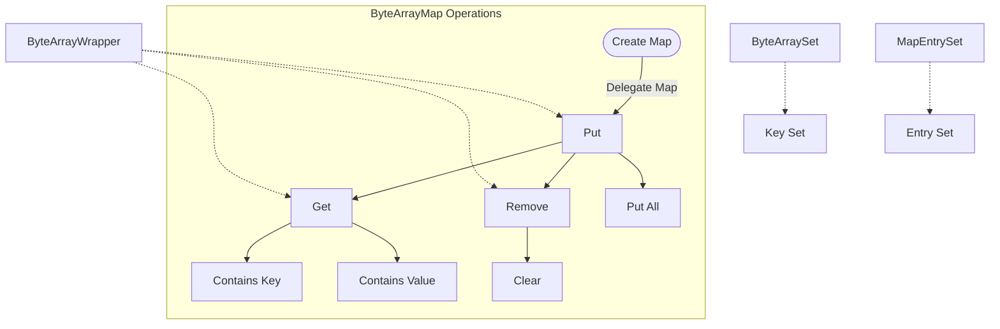

## Module: ByteArrayMap.java
- **模块名称**: ByteArrayMap.java

- **主要目的**: 该模块旨在提供一个特定的映射(map)，它使用字节数组(byte[])作为键，通过封装字节数组为`ByteArrayWrapper`来实现键的比较和存储，从而允许字节数组直接作为键使用。

- **关键功能**:
  - `put(byte[] key, V value)`: 将指定的值与此映射中的指定键关联。
  - `get(Object key)`: 返回指定键所映射的值。
  - `remove(Object key)`: 删除指定键的映射。
  - `containsKey(Object key)`: 如果此映射包含指定键的映射，则返回true。
  - `keySet()`, `values()`, `entrySet()`: 分别返回此映射中包含的键的集合、值的集合以及键值对的集合。

- **关键变量**:
  - `delegate`: 一个`Map<ByteArrayWrapper, V>`类型的变量，用于实际存储键值对。

- **相互依赖性**: 该模块依赖于`ByteArrayWrapper`类来封装字节数组作为键，以及依赖于Java的`Map`接口和相关实现（如`HashMap`）来进行实际的数据存储和操作。

- **核心与辅助操作**:
  - 核心操作包括键值对的添加(`put`)、查询(`get`)和删除(`remove`)。
  - 辅助操作包括检查映射是否为空(`isEmpty`)、获取键集(`keySet`)、值集(`values`)和键值对集(`entrySet`)。

- **操作顺序**: 通常，使用该映射时首先会通过`put`方法添加键值对，然后可以使用`get`、`remove`等方法进行查询或修改操作。

- **性能方面**: 使用`ByteArrayWrapper`作为键的封装可能会引入额外的对象创建和管理开销，但是允许直接使用字节数组作为键，这在处理特定类型的数据（如加密密钥）时非常有用。

- **可重用性**: 该模块设计为通用的映射实现，可以在需要使用字节数组作为键的任何场景下重用。

- **使用**: 该模块可以在需要对字节数组进行唯一映射的应用中使用，如在加密、网络传输或文件处理等领域。

- **假设**:
  - 假设用户理解字节数组作为键的含义，并正确使用`ByteArrayWrapper`进行键的封装。
  - 假设在并发环境下，用户需要自行处理线程安全问题，因为标准的`HashMap`不是线程安全的。
## Flow Diagram [via mermaid]

