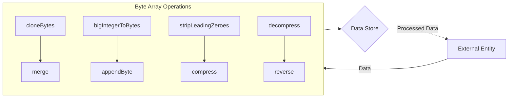

## Module: ByteUtil.java
根据提供的代码模块，以下是用中文进行的全面分析：

- **模块名称**：ByteUtil.java

- **主要目标**：该模块的目的是提供一组与字节操作相关的实用工具方法，以支持在以太坊J库中的数据处理和转换需求。

- **关键函数**：
  - `cloneBytes`：克隆字节数组。
  - `bigIntegerToBytes`：将BigInteger转换为字节数组。
  - `merge`：合并多个字节数组。
  - `appendByte`：在字节数组末尾追加一个字节。
  - `byteArrayToInt`、`intToBytes`、`bytesToBigInteger`等：进行基本的数据类型转换。
  - `stripLeadingZeroes`和`stripEndingZeroes`：去除字节数组前后的零。
  - `compress`和`decompress`：对字节数组进行压缩和解压缩。

- **关键变量**：
  - `EMPTY_BYTE_ARRAY`：一个空的字节数组常量。
  - `ZERO_BYTE_ARRAY`：一个只包含单个零字节的数组常量。
  - `WORD_SIZE`：定义了一个字（word）的大小，为32字节。

- **相互依赖**：该模块主要独立，但在处理特定数据格式（如BigInteger、int等）时，依赖于Java标准库中的类和方法。

- **核心与辅助操作**：
  - 核心操作包括字节数据的转换、合并、压缩和解压缩等。
  - 辅助操作包括比较、复制和格式化输出等。

- **操作序列**：通常，操作序列取决于调用者的需求。例如，在发送数据前，可能会先进行压缩，然后在接收端进行解压缩。

- **性能方面**：性能考虑包括压缩和解压缩的效率、数据转换的速度以及内存使用。优化这些操作可以提高整体性能。

- **可重用性**：该模块提供的方法具有高度的通用性和可重用性，可被应用于多种不同的场景和项目中，特别是需要处理字节数据的场合。

- **使用**：在以太坊J库以及其他需要进行字节操作的Java应用中广泛使用，如数据加密、解密、数据压缩和格式转换等。

- **假设**：
  - 输入的字节数组是合法的，且符合预期的格式。
  - 在进行压缩和解压缩操作时，假设数据是可以被成功压缩和解压的，没有考虑到所有可能的异常情况。

这个分析提供了对ByteUtil.java模块功能和使用场景的全面理解，帮助开发者更好地利用这些工具方法。
## Flow Diagram [via mermaid]

