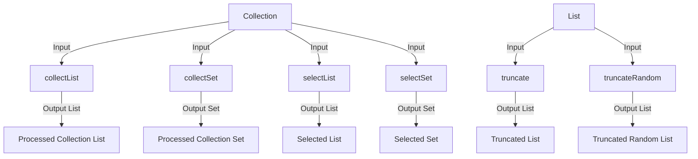

## Module: CollectionUtils.java
- **模块名称**：CollectionUtils.java

- **主要目标**：该模块旨在提供一系列静态工具方法，用于处理Java集合（如List和Set），包括集合的转换、筛选和截断等操作。

- **关键函数**：
  - `collectList`：将集合中的元素通过指定的函数转换后收集到List中。
  - `collectSet`：将集合中的元素通过指定的函数转换后收集到Set中，以去除重复元素。
  - `truncate`：限制List的大小，超出部分将被截断。
  - `truncateRandom`：随机截断List到指定大小，支持部分元素固定不随机。
  - `selectList`：根据给定的条件筛选集合中的元素，并将结果收集到List中。
  - `selectSet`：根据给定的条件筛选集合中的元素，并将结果收集到Set中，以去除重复元素。

- **关键变量**：无明显的关键变量，主要操作依赖于方法的输入参数。

- **互依赖性**：该模块主要依赖于Java的集合框架，如ArrayList、HashSet等，以及Java 8引入的函数式编程特性，包括Function和Predicate接口。

- **核心 vs. 辅助操作**：
  - 核心操作包括集合的转换、筛选和截断。
  - 该模块未明确区分辅助操作，但可以认为所有操作都是为了支持集合数据的处理和操作。

- **操作序列**：无特定的操作序列，每个方法都可以独立使用，根据需要对集合进行操作。

- **性能方面**：性能考虑主要集中在集合操作的效率上，如在使用`collectSet`进行去重操作时，选择HashSet以优化性能；在`truncateRandom`中，通过先固定部分元素再随机截断的方式，可能会涉及到额外的集合操作，影响性能。

- **可重用性**：该模块提供的静态工具方法具有很高的可重用性，可应用于多种集合操作场景。

- **使用**：可以在需要对集合进行转换、筛选、截断等操作的场合使用该模块的方法，如在处理数据库查询结果或进行批量数据处理时。

- **假设**：该模块假设传入的集合和函数/谓词非空，且在使用`truncateRandom`方法时，假设`confirm`参数小于等于`limit`参数，并且都不超过原集合大小。
## Flow Diagram [via mermaid]

