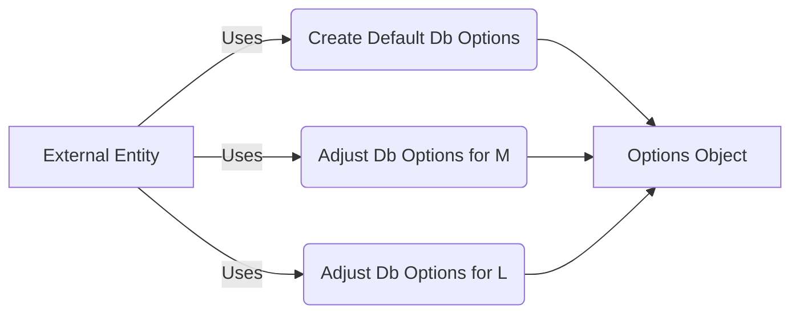

## Module: DbOptionalsUtils.java
- **模块名称**：DbOptionalsUtils.java

- **主要目标**：该模块的目的是提供用于配置LevelDB数据库选项的实用工具方法，包括数据库的创建、校验、压缩类型、块大小、写缓冲区大小、缓存大小和最大打开文件数的默认设置。

- **关键功能**：
  - `createDefaultDbOptions()`：创建并返回一个包含默认数据库选项的`Options`对象。
  - `newDefaultDbOptions(String name, Options defaultOptions)`：根据数据库名称调整并返回默认的数据库选项，特别是针对不同的读取需求（频繁读取和大量读取）进行优化。

- **关键变量**：
  - `DEFAULT_COMPRESSION_TYPE`、`DEFAULT_BLOCK_SIZE`、`DEFAULT_WRITE_BUFFER_SIZE`、`DEFAULT_CACHE_SIZE`、`DEFAULT_MAX_OPEN_FILES`：定义了数据库操作的默认参数。
  - `DB_M`和`DB_L`：分别代表需要大量读取和频繁读取的数据库列表。

- **依赖性**：主要与LevelDB的`org.iq80.leveldb.Options`类交互，用于配置数据库选项。

- **核心与辅助操作**：
  - 核心操作包括创建具有默认设置的数据库选项，以及根据数据库的不同使用需求调整这些选项。
  - 辅助操作包括定义默认设置和数据库类型列表。

- **操作序列**：首先，根据需要创建默认的数据库选项。其次，如果数据库名称出现在特定列表中（`DB_M`或`DB_L`），则会根据列表类型调整数据库选项以优化性能。

- **性能方面**：通过为不同的数据库使用场景（如频繁读取和大量读取）提供优化的数据库选项，考虑了性能优化。

- **可重用性**：该模块通过提供灵活的数据库选项配置方法，可在不同的数据库实例和场景中重用。

- **使用**：在需要配置LevelDB数据库选项时使用此模块，特别是在需要针对特定读取模式优化数据库性能的情况下。

- **假设**：假设存在两种主要的数据库使用场景（频繁读取和大量读取），并且可以通过调整特定的选项（如最大打开文件数和写缓冲区大小）来优化这些场景的性能。
## Flow Diagram [via mermaid]

