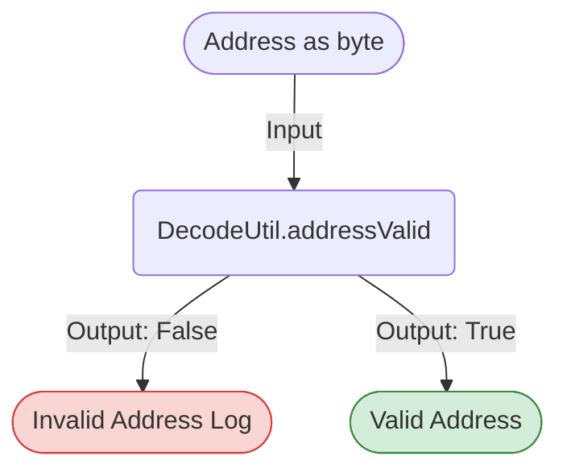

## Module: DecodeUtil.java
模块名称：DecodeUtil.java

主要目标：该模块的目的是提供与地址解码相关的实用功能，特别是验证地址的有效性。

关键功能：
- `addressValid(byte[] address)`: 这是模块中的主要方法，用于验证给定的地址是否符合特定的格式要求，包括长度和前缀。

关键变量：
- `ADDRESS_SIZE`: 定义了地址应有的大小（42位）。
- `addressPreFixByte` 和 `addressPreFixString`: 分别定义了地址前缀的字节和字符串形式，用于校验地址的前缀是否正确。

依赖关系：
- 该模块依赖于`org.apache.commons.lang3.ArrayUtils`用于数组操作，以及`org.tron.core.Constant`用于获取地址格式的常量。

核心与辅助操作：
- 核心操作是地址验证（`addressValid`方法）。
- 模块没有明显的辅助操作，其主要集中在地址有效性的检查上。

操作序列：
- 首先检查地址数组是否为空。
- 然后检查地址长度是否正确。
- 最后检查地址的前缀是否符合预期。

性能方面：
- 性能考虑主要集中在对地址数组的操作上，应确保这些操作尽可能高效。

可重用性：
- 这个模块很容易被重用于任何需要地址验证功能的地方，因为它提供了一个简单的接口和清晰的实现。

使用方式：
- 通过调用`addressValid`方法，并传入一个地址数组，可以使用此模块来验证地址的有效性。

假设：
- 假设所有的地址都应当遵循特定的格式，包括长度和前缀。

总的来说，DecodeUtil.java模块提供了一个简单而有效的方法来验证地址的有效性，它通过检查地址的长度和前缀来确保地址符合预期的格式。该模块的设计使得它可以很容易地被重用于需要地址验证功能的任何地方。
## Flow Diagram [via mermaid]

