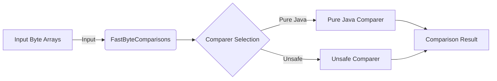

## Module: FastByteComparisons.java
- **模块名称**：FastByteComparisons.java

- **主要目标**：该模块的目的是提供一种优化的方式来比较字节数组，允许在非零偏移处开始比较数组。这对于需要高效比较字节数据的场合（如加密货币平台）尤其重要。

- **关键函数**：
  - `isEqual(byte[] b1, byte[] b2)`：判断两个字节数组是否相等。
  - `compareTo(byte[] b1, int s1, int l1, byte[] b2, int s2, int l2)`：字典序比较两个字节数组。

- **关键变量**：
  - `BEST_COMPARER`：最佳比较器，根据系统能否使用`Unsafe`类，自动选择最佳实现方式。

- **相互依赖性**：此模块依赖于Guava库中的`UnsignedBytes`类的设计思想，并通过反射技术尝试使用`Unsafe`优化比较性能，若失败则回退到纯Java实现。

- **核心与辅助操作**：
  - 核心操作：字典序比较字节数组。
  - 辅助操作：提供回退机制以保证在不同环境下的兼容性。

- **操作序列**：首先尝试使用基于`Unsafe`的比较器进行字节比较，如果环境不支持，则使用纯Java实现的比较器。

- **性能方面**：通过使用`Unsafe`类（当可用时），可以显著提高字节比较的性能，因为它允许直接访问底层内存，减少了Java层面的开销。

- **可重用性**：这个模块设计为高度可重用，可以轻松集成到需要进行字节比较的任何Java项目中。

- **使用**：主要用于需要快速比较字节数组的场合，如在以太坊J（ethereumJ）库中用于比较区块链数据。

- **假设**：假设系统中存在`Unsafe`类，并且可以安全地使用。如果这个假设不成立，模块会自动使用纯Java比较器。
## Flow Diagram [via mermaid]

