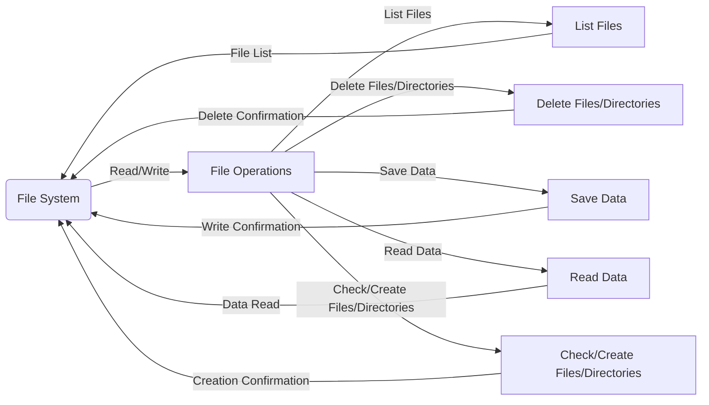

## Module: FileUtil.java
**模块名称**：FileUtil.java

**主要目的**：FileUtil.java 模块的目的是提供一套文件操作的工具方法，包括文件的读取、写入、创建、删除以及目录的递归遍历和删除等功能。

**关键函数**：
- `recursiveList(String path)`：递归列出给定路径下的所有文件。
- `recursiveDelete(String fileName)`：递归删除给定文件名的文件或目录。
- `saveData(String filePath, String data, boolean append)`：将数据保存到指定的文件路径，支持追加模式。
- `readData(String filePath, char[] buf)`：从指定的文件路径读取数据到字符数组中。
- `deleteDir(File dir)`：删除指定的目录及其所有子目录和文件。
- `createFileIfNotExists(String filepath)`：如果文件不存在，则创建新文件。
- `createDirIfNotExists(String dirPath)`：如果目录不存在，则创建新目录。
- `isExists(String path)`：检查给定路径的文件或目录是否存在。

**关键变量**：无特别指出的关键变量，但函数参数如`filePath`、`data`、`dirPath`等在文件操作中扮演重要角色。

**相互依赖性**：此模块主要依赖于Java的文件I/O操作类，如`File`、`BufferedReader`、`BufferedWriter`等，以及Java NIO文件访问接口，如`Paths`、`Files`等。

**核心与辅助操作**：文件和目录的创建、读取、写入和删除操作属于核心功能；而检查文件或目录是否存在的操作则更多地起到辅助作用。

**操作序列**：部分方法如递归删除和递归列表展示了明确的操作流程，即从一个起始点出发，逐步深入每一个子目录或文件，并执行相应的操作。

**性能考虑**：在处理大量文件或大型目录时，递归操作（如`recursiveList`和`recursiveDelete`）可能会影响性能，特别是在深层次的文件结构中。

**可重用性**：此模块提供的文件操作方法是高度通用的，可在多种不同的项目和场景中重用。

**使用方式**：通过直接调用其公开的静态方法，用户可以轻松实现文件的读写、创建和删除等操作。

**假设**：模块在设计时假设文件系统访问权限是允许的，并且外部环境能够正常支持Java的文件I/O操作。
## Flow Diagram [via mermaid]

