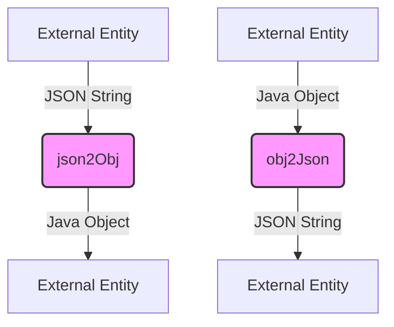

## Module: JsonUtil.java
- **模块名称**：JsonUtil.java

- **主要目标**：该模块的主要目的是提供JSON字符串与Java对象之间的相互转换功能。它使得应用程序能够轻松地将数据在内部对象表示和JSON格式之间转换，从而支持数据的序列化和反序列化。

- **关键函数**：
  - `json2Obj(String jsonString, Class<T> clazz)`：将JSON字符串转换为Java对象。它接受一个JSON格式的字符串和目标类的Class对象，然后返回该类的一个实例。
  - `obj2Json(Object obj)`：将Java对象转换为JSON字符串。它接受一个Java对象，然后返回代表该对象的JSON格式的字符串。

- **关键变量**：
  - `ObjectMapper om`：用于在对象和JSON之间进行转换的核心类。

- **相互依赖性**：此模块依赖于`com.fasterxml.jackson.databind.ObjectMapper`来执行实际的序列化和反序列化操作，同时也依赖于Spring框架的`org.springframework.util.StringUtils`类来检查字符串是否为空。

- **核心与辅助操作**：
  - 核心操作包括`json2Obj`和`obj2Json`方法，它们直接支持JSON与对象之间的转换。
  - 辅助操作可能包括错误处理和输入验证，这些操作确保了转换过程的稳定性和可靠性。

- **操作顺序**：在调用`json2Obj`或`obj2Json`方法时，首先会进行输入验证（例如，检查输入字符串是否为空），然后使用`ObjectMapper`实例执行转换操作。如果转换过程中发生错误，将抛出运行时异常。

- **性能方面**：性能考虑主要涉及到`ObjectMapper`的使用，因为对象的序列化和反序列化可能是计算密集型的。合理地使用和复用`ObjectMapper`实例可以提高性能。

- **可重用性**：由于`JsonUtil`提供的是通用的JSON与对象之间的转换功能，它可以在多个项目中重用，无需针对特定的数据结构进行修改。

- **使用**：该模块可以被任何需要进行JSON序列化或反序列化的Java应用程序使用。它对于处理RESTful API的请求和响应尤为有用，因为这些操作通常涉及到JSON数据格式。

- **假设**：在设计`JsonUtil`时，做出了一些假设，包括输入的JSON字符串格式正确，以及用户希望在发生转换错误时接收到运行时异常，而不是返回null或使用默认值。
## Flow Diagram [via mermaid]

