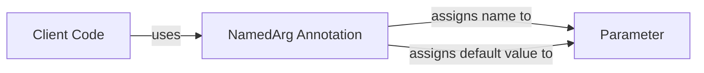

## Module: NamedArg.java
- **模块名称**：NamedArg.java

- **主要目标**：该模块的目的是提供一个注解工具，用于标注方法参数的名称和默认值。这在需要明确参数名以提高代码可读性或者在使用反射技术动态处理参数时尤为重要。

- **关键功能**：
  - `value()`：返回被注解参数的名称。
  - `defaultValue()`：返回被注解参数的默认值，如果未指定，则默认为空字符串。

- **关键变量**：该模块中，关键的"变量"实际是注解的属性，即`value`和`defaultValue`。

- **互依性**：该注解模块主要与使用它的方法或构造函数参数互相依赖。它可能与反射API一起使用，以动态地获取参数的名称和默认值。

- **核心与辅助操作**：在此模块中，定义注解属性（`value`和`defaultValue`）是核心操作，因为它们直接关系到注解的主要功能。没有明显的辅助操作。

- **操作序列**：由于这是一个注解模块，它本身不定义操作序列。它的作用是通过注解的形式提供信息，供其他代码在运行时解析和使用。

- **性能方面**：作为一个注解，该模块对性能的影响极小。注解本身在代码运行时可能对性能有轻微影响，但这通常可以忽略不计。

- **可重用性**：该注解具有很高的可重用性，因为它提供了一种标准化的方法来指定参数的名称和默认值。它可以在任何需要此信息的场景中重用，不限于特定类型的方法或参数。

- **使用**：它通过在方法参数前使用`@NamedArg`注解来使用。开发者可以指定参数的名称和（可选的）默认值，这对于提高代码的可读性和支持反射技术中的动态参数处理非常有用。

- **假设**：该模块的设计假设是，开发者在使用时会正确地标注参数的名称和默认值。此外，还假设在解析这些注解的代码中会适当地处理这些值，尤其是默认值的处理。
## Flow Diagram [via mermaid]

