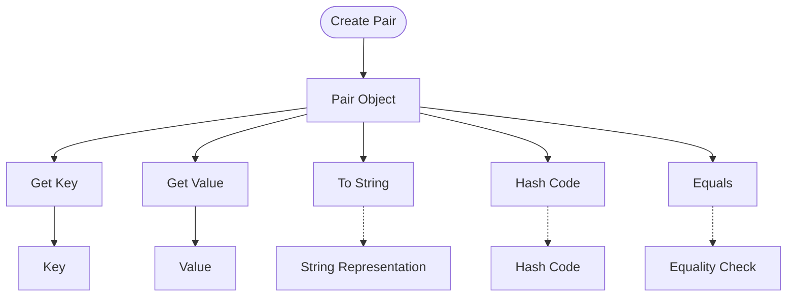

## Module: Pair.java
- **模块名称**：Pair.java

- **主要目的**：该模块的主要目的是提供一个便利的类来表示名称-值对，这在很多编程场景中都非常有用，比如在处理键值对数据时。

- **关键函数**：
  - `public Pair(K key, V value)`：构造函数，用于创建一个新的键值对。
  - `public K getKey()`：获取键值对的键。
  - `public V getValue()`：获取键值对的值。
  - `public String toString()`：返回键值对的字符串表示形式，通常用于调试。
  - `public int hashCode()`：生成键值对的哈希码，用于支持哈希表。
  - `public boolean equals(Object o)`：判断两个键值对是否相等。

- **关键变量**：
  - `private K key`：键值对的键。
  - `private V value`：键值对的值。

- **相互依赖性**：该模块主要依赖于`java.io.Serializable`接口以支持序列化，以及`java.util.Objects`类用于比较和计算哈希码。

- **核心与辅助操作**：构造键值对、获取键和值是核心操作；而生成字符串表示、计算哈希码和判断相等性则是辅助操作，这些操作主要用于支持和优化键值对的使用。

- **操作序列**：通常首先通过构造函数创建一个键值对，然后可以通过`getKey`和`getValue`方法获取键和值，也可以使用`toString`、`hashCode`和`equals`方法进行调试和集合操作。

- **性能方面**：性能考虑主要体现在`hashCode`和`equals`方法的实现上，这两个方法的设计直接影响到键值对在哈希表中的性能。

- **可重用性**：Pair类设计为一个通用的键值对类，其泛型设计使得它可以很容易地被重用于不同类型的键和值。

- **使用**：该类可以在任何需要键值对表示的场景下使用，例如在映射、参数传递或者数据处理中。

- **假设**：在设计时假定键和值可以是任何类型，但是键的比较和哈希码计算依赖于`Objects.equals`和`Objects.hashCode`，这意味着键和值类型需要正确实现`equals`和`hashCode`方法。
## Flow Diagram [via mermaid]

