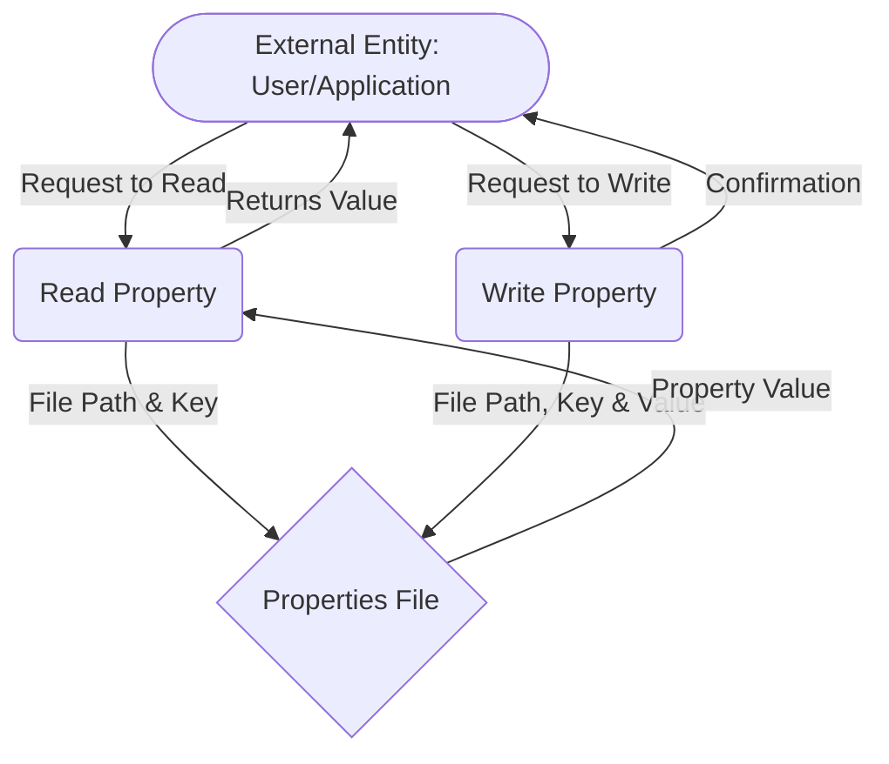

## Module: PropUtil.java
- **模块名称**：PropUtil.java

- **主要目标**：该模块的目的是提供一个简单的工具类，用于处理Java属性文件（.properties）的读写操作。它允许用户从属性文件中读取属性值，以及将属性值写入属性文件。

- **关键功能**：
  - `readProperty(String file, String key)`：从指定的属性文件中读取与给定键相关联的值。
  - `writeProperty(String file, String key, String value)`：将给定的键值对写入指定的属性文件。

- **关键变量**：在这个模块中，主要操作的是`Properties`类的实例，它用于加载、读取和存储属性值。

- **相互依赖性**：该模块依赖于Java的标准I/O类（如`FileInputStream`、`BufferedInputStream`、`BufferedReader`、`FileOutputStream`、`BufferedWriter`等）来执行文件操作，以及`Properties`类来处理属性数据。

- **核心与辅助操作**：核心操作是读取和写入属性文件的功能，辅助操作包括处理I/O流的打开和关闭，以及字符编码转换。

- **操作序列**：读取属性时，首先打开文件输入流，然后加载属性；写入属性时，首先读取现有属性文件，然后添加或更新键值对，最后将更改写回文件。

- **性能方面**：性能考虑包括正确管理I/O资源（如关闭流），以避免资源泄露，以及处理大型属性文件时的效率。

- **可重用性**：这个工具类是高度通用的，可以轻松地在需要处理属性文件的任何Java应用程序中重用。

- **使用**：可以在需要读取或更新配置信息的应用程序中使用此模块，例如，读取数据库连接信息或应用程序设置。

- **假设**：假设属性文件是以ISO-8859-1编码存储的，但实际上，属性值在返回之前会转换为UTF-8编码。此外，还假设用户不会直接编辑由应用程序生成的属性文件，因为写入属性时会附加警告信息。
## Flow Diagram [via mermaid]

