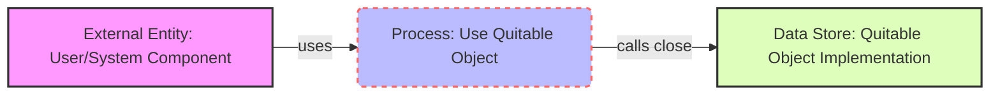

## Module: Quitable.java
由于原始问题中没有提供具体的代码实现，只提供了一个非常简单的接口定义，因此分析将基于这个接口的概念和可能的用途进行推测。

- **模块名称**：Quitable.java

- **主要目标**：这个接口的目的是为实现它的类提供一个统一的退出或关闭的机制。通过扩展`AutoCloseable`接口，它暗示了任何实现了`Quitable`接口的类都可以被“关闭”，这通常与释放资源或优雅地终止操作有关。

- **关键函数**：由于`Quitable`是一个接口，并且直接扩展了`AutoCloseable`接口，它继承了`AutoCloseable`的`close()`方法。这是它的主要（也是唯一的）方法，用于执行关闭或退出操作。

- **关键变量**：这个接口本身不直接定义任何变量。

- **相互依赖性**：作为一个接口，`Quitable`的实现类可能会与系统中负责资源管理的其他组件有交互，尤其是在这些组件需要被优雅地关闭或资源需要被释放时。

- **核心与辅助操作**：在这个接口中，没有明确区分核心与辅助操作。但可以认为，实现`close()`方法的逻辑将是任何实现类的核心功能，因为这直接关系到资源的释放和关闭逻辑。

- **操作序列**：由于`Quitable`仅定义了一个接口并继承了`close()`方法，操作序列将完全依赖于实现该接口的类如何定义`close()`方法的具体行为。

- **性能方面**：实现`Quitable`接口的类在设计时需要考虑到关闭操作的性能影响，尤其是在处理大量资源或需要维护高可用性的系统中。

- **可重用性**：`Quitable`接口的设计简洁且目的明确，这使得它容易被不同的类实现，从而增强了代码的可重用性。任何需要优雅关闭或资源释放逻辑的组件都可以考虑实现这个接口。

- **使用**：在实际应用中，任何需要清理资源或需要优雅终止的组件或服务都可以实现`Quitable`接口。这包括文件处理、网络连接管理、数据库连接管理等场景。

- **假设**：设计`Quitable`接口的一个基本假设是，实现它的类具有一些需要在对象生命周期结束时释放的资源。此外，还假设调用者负责在适当的时候调用`close()`方法来触发清理逻辑。

这个分析基于对`Quitable`接口定义的解读，并假设了一些可能的实现和使用场景。在没有具体实现代码的情况下，这些推断提供了一个关于如何使用和实现该接口的概念性视角。
## Flow Diagram [via mermaid]

