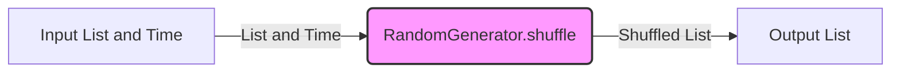

## Module: RandomGenerator.java
基于提供的代码模块，以下是用中文进行的全面分析：

- **模块名称**：RandomGenerator.java

- **主要目标**：该模块的目的是提供一个通用的随机生成器，用于打乱列表中元素的顺序。

- **关键函数**：
  - `shuffle(List<T> list, long time)`：这是该模块的主要方法，它接受一个列表和一个时间戳，利用时间戳和预设的随机生成数字来打乱列表中元素的顺序。

- **关键变量**：
  - `RANDOM_GENERATOR_NUMBER`：一个静态长整型变量，用作随机数生成的基数。
  
- **相互依赖性**：此模块主要独立运行，但依赖于Java的List接口以及日志记录功能（通过lombok的@Slf4j实现），用于处理列表和记录相关的警告信息。

- **核心与辅助操作**：
  - 核心操作：`shuffle`方法是该模块的核心操作，实现了列表的随机打乱。
  - 辅助操作：日志记录，用于在发生异常情况时记录警告信息。

- **操作序列**：`shuffle`方法首先根据传入的时间戳生成一个基础随机数，然后遍历列表中的每个元素，为每个元素生成一个唯一的随机数，并根据这个随机数与列表大小的关系，交换列表中的元素位置。

- **性能方面**：该模块的性能主要取决于列表的大小和随机数生成的效率。大型列表可能会增加计算时间，但由于算法的设计，性能通常是可接受的。

- **可重用性**：由于该模块是以泛型实现的，它可以用于任何类型的List，具有很高的可重用性。

- **使用**：可以在需要随机打乱列表元素顺序的场景中使用此模块，如游戏、模拟抽奖等应用。

- **假设**：
  - 假设传入的列表是可修改的。
  - 假设时间戳是有效的，并且能够作为生成随机数的一个因素。

通过这个分析，我们可以看出RandomGenerator.java模块提供了一个灵活且高效的方式来随机打乱列表中的元素，其设计允许它在多种场景下被重用，虽然它在操作时依赖于特定的随机数生成逻辑，但整体上是一个非常实用的工具。
## Flow Diagram [via mermaid]

