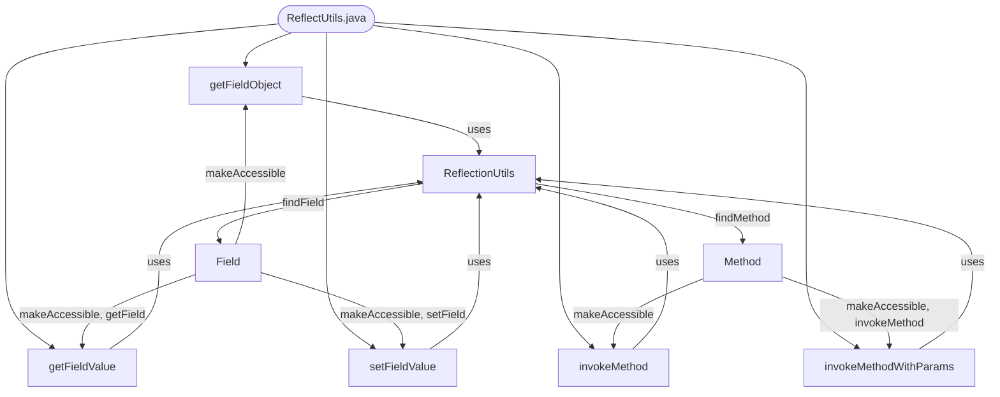

## Module: ReflectUtils.java
**模块名称**：ReflectUtils.java

**主要目标**：该模块的主要目的是为了提供一种简便的方式来处理Java反射操作，使得在运行时能够动态地访问和修改对象的字段和方法。

**关键函数**：
- `getFieldObject(Object target, String fieldName)`：获取目标对象的指定字段的值。
- `getFieldValue(Object target, String fieldName)`：获取目标对象的指定字段的值，返回类型为泛型T。
- `setFieldValue(Object target, String fieldName, Object value)`：设置目标对象的指定字段的值。
- `invokeMethod(Object target, String methodName)`：调用目标对象的无参方法。
- `invokeMethod(Object target, String methodName, Class[] param, Object... args)`：调用目标对象的指定参数的方法。

**关键变量**：无直接变量，主要操作的是通过参数传入的对象的字段和方法。

**依赖性**：该模块依赖于`org.springframework.util.ReflectionUtils`，表明它在实现功能时依赖Spring框架提供的反射工具类。

**核心与辅助操作**：核心操作包括字段的获取与设置、方法的调用。辅助操作可能包括使字段或方法可访问的处理。

**操作序列**：通常，使用此模块的操作序列开始于获取字段或方法的引用，然后是对这些字段或方法的操作（读取、修改、调用）。

**性能方面**：使用反射通常会比直接代码调用有更高的性能开销。因此，在性能敏感的应用中，应谨慎使用。

**可重用性**：这个工具类的设计使其具有很高的可重用性，可以在任何需要动态操作对象字段或方法的场景中使用。

**使用**：该模块可以在需要动态访问或修改对象属性，或者在运行时调用对象方法的场景中使用，特别是在框架开发或者需要大量反射操作的应用中。

**假设**：假设目标对象的字段或方法在运行时是可访问的，或者通过使其可访问来满足需求。此外，还假设调用者知道目标字段或方法的名称和类型。
## Flow Diagram [via mermaid]

