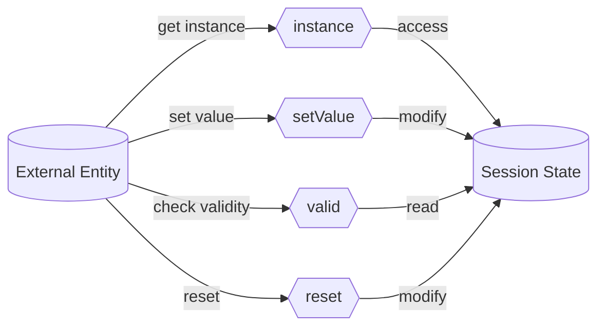

## Module: SessionOptional.java
- **模块名称**: SessionOptional.java

- **主要目标**: 该模块旨在提供一个封装了`ISession`对象的可选包装器，使得对会话对象的管理更加灵活和安全。

- **关键函数**:
  - `instance()`: 获取`SessionOptional`的单例实例。
  - `setValue(ISession value)`: 设置`SessionOptional`中的`ISession`值，如果当前没有值。
  - `valid()`: 检查当前是否有有效的`ISession`值。
  - `reset()`: 重置`SessionOptional`，销毁当前的`ISession`（如果存在），并将值设置为空。

- **关键变量**:
  - `INSTANCE`: `SessionOptional`的单例实例。
  - `value`: 存储`ISession`对象的`Optional`容器。

- **依赖性**:
  - 与`ISession`接口紧密相关，`SessionOptional`的行为依赖于`ISession`实例的状态和行为。

- **核心与辅助操作**:
  - 核心操作包括`setValue`、`valid`和`reset`，它们直接管理`ISession`的状态。
  - 辅助操作包括`instance()`，用于获取`SessionOptional`的实例。

- **操作序列**:
  - 通常首先通过`instance()`获取`SessionOptional`的实例，然后通过`setValue`设置`ISession`的值，使用`valid`检查值是否设置，最后在不需要时通过`reset`重置。

- **性能方面**:
  - 该模块通过同步方法保证线程安全，但可能会稍微影响性能。然而，考虑到它管理的是会话状态，这种权衡通常是可接受的。

- **可重用性**:
  - `SessionOptional`设计为通用的会话管理工具，可在需要管理`ISession`生命周期的不同场景中重用。

- **使用方法**:
  - 主要用于需要灵活管理数据库会话生命周期的场景，如在需要确保会话在使用后被正确关闭的环境中。

- **假设**:
  - 假设`ISession`实现了`destroy`方法，以确保会话可以被正确销毁。
  - 假设在整个应用中只需要一个`SessionOptional`实例来管理会话状态。
## Flow Diagram [via mermaid]

