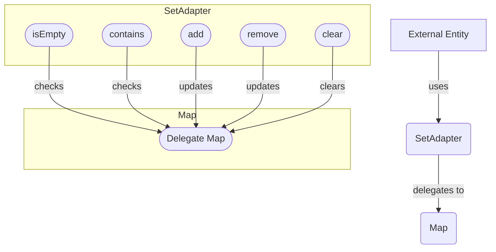

## Module: SetAdapter.java
- **模块名称**：SetAdapter.java

- **主要目标**：该模块的目的是提供一个适配器，使得Map接口可以像Set接口一样工作。这主要是通过将Map的键用作集合的元素来实现的，而Map的值则不重要（使用一个虚拟值表示）。

- **关键功能**：
  - `add(E e)`：将元素添加到集合中，实际上是将元素作为键添加到委托Map中。
  - `remove(Object o)`：从集合中移除指定元素，实际上是从委托Map中移除键。
  - `contains(Object o)`：检查集合是否包含指定元素，实际上是检查委托Map的键是否包含该元素。
  - `size()`、`isEmpty()`、`iterator()`、`toArray()` 等方法提供标准的集合操作，内部通过操作委托Map实现。

- **关键变量**：
  - `Map<E, Object> delegate`：这是一个Map，用作实际存储机制，其中键代表Set的元素。

- **相互依赖性**：此模块依赖于Java的Map接口及其实现，因为它是通过包装一个Map对象来提供Set接口的功能。

- **核心与辅助操作**：
  - 核心操作包括`add`、`remove`、`contains`等，因为它们直接对应于Set的基本操作。
  - 辅助操作可能包括`toArray`方法，因为它们提供额外的便利但不是Set接口的核心部分。

- **操作序列**：通常，使用此适配器的流程涉及创建实例，然后通过调用`add`、`remove`等方法来修改集合，最终可能通过`iterator`或`toArray`等方法遍历或检索集合内容。

- **性能方面**：性能将直接受到委托Map实现的影响。例如，使用HashMap将提供不同的性能特征与使用TreeMap。

- **可重用性**：此适配器模式的设计允许它通过替换其委托Map来适应不同的需求，增强了其可重用性。

- **用途**：可以在需要Set接口但实际上想要利用Map特性（例如，确保元素唯一性而不需要额外的值）的场景中使用此适配器。

- **假设**：
  - 委托Map正确实现了Map接口。
  - 用户不需要Set中元素的顺序信息，因为大多数Map实现不保证顺序。
## Flow Diagram [via mermaid]

