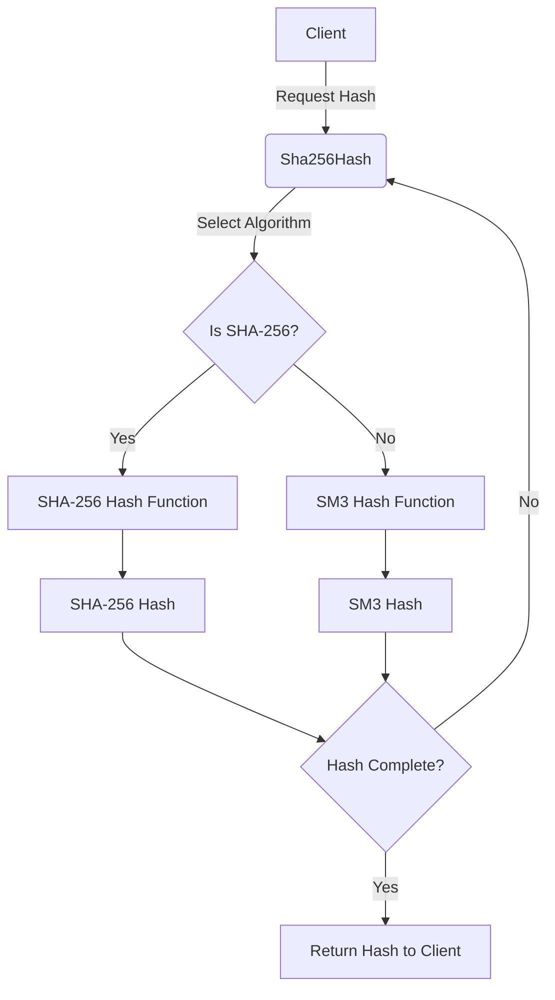

## Module: Sha256Hash.java
- **模块名称**：Sha256Hash.java

- **主要目的**：Sha256Hash类的目的是提供一个封装了byte[]的数据结构，以便正确实现equals和hashCode方法，允许其作为映射中的键使用。此外，该类还确保了长度的正确性，并提供了更多的类型安全性。它主要用于生成和处理SHA-256哈希值。

- **关键函数**：
  - `wrap(byte[] rawHashBytes)`：创建一个新实例，封装给定的哈希值。
  - `of(boolean isSha256, byte[] contents)`：根据给定的字节计算（一次性）哈希值，并返回包含计算结果的新实例。
  - `twiceOf(boolean isSha256, byte[] contents)`：计算给定字节的哈希值，然后再次对结果哈希值进行哈希计算。
  - `newDigest()`：返回一个新的SHA-256 MessageDigest实例。
  - `hash(boolean isSha256, byte[] input)`：计算给定字节的SHA-256哈希值。
  - `hashTwice(boolean isSha256, byte[] input)`：计算给定字节的SHA-256哈希值，然后对结果进行再次哈希计算。

- **关键变量**：
  - `LENGTH`：哈希长度，即32字节。
  - `bytes`：封装的哈希值的字节数组。

- **相互依赖性**：该类使用了Google的`com.google.common`库进行一些基本的参数检查和字节操作，同时也依赖于Java安全库中的`MessageDigest`类来生成SHA-256哈希值。

- **核心与辅助操作**：核心操作包括哈希值的生成和验证，辅助操作包括哈希值的比较、转换为字符串表示等。

- **操作序列**：一个典型的使用序列可能是先使用`of`方法计算某些数据的哈希值，然后通过`equals`或`compareTo`方法与其他哈希值进行比较。

- **性能方面**：性能主要取决于底层哈希函数的效率，以及如何处理大量的哈希计算和比较操作。

- **可重用性**：该类设计得足够通用，可以在需要SHA-256哈希值的任何场景中重用。

- **使用**：可以在加密、数据完整性验证、区块链等多种场景中使用Sha256Hash类来生成和处理哈希值。

- **假设**：假设输入的字节长度是正确的，并且使用者理解SHA-256哈希的基本概念和安全性。
## Flow Diagram [via mermaid]

