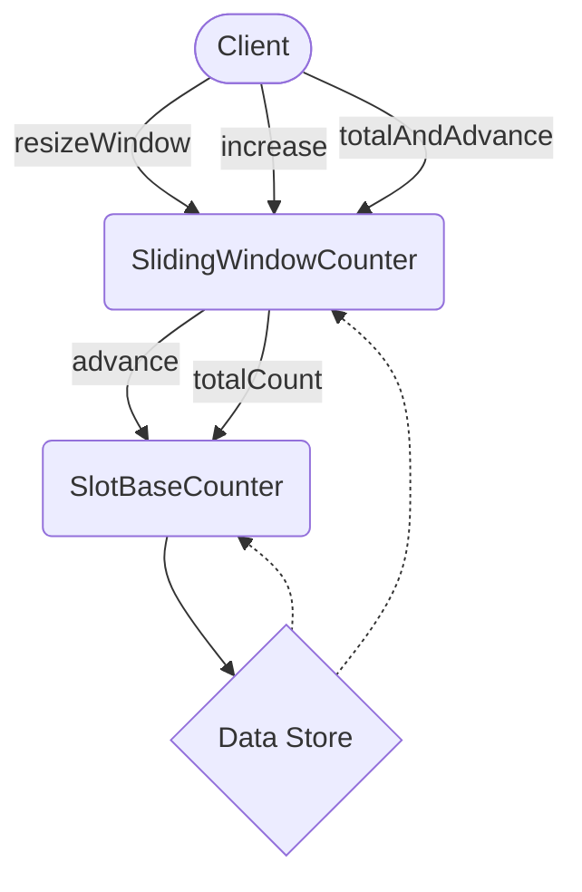

## Module: SlidingWindowCounter.java
- **模块名称**：SlidingWindowCounter.java

- **主要目标**：该模块的目的是提供一个滑动窗口计数器，用于在给定的窗口大小内跟踪和计算事件的发生次数。这种类型的计数器在需要对时间序列数据进行分段统计时非常有用，例如网络流量监控、实时数据分析等场景。

- **关键函数**：
  - `resizeWindow(int windowSize)`: 调整滑动窗口的大小。
  - `increase()`: 在当前位置增加计数。
  - `totalAndAdvance()`: 计算当前窗口的总计数，并将窗口向前移动一位。
  - `advance()`: 仅将窗口向前移动一位，不计算总计数。
  - `totalCount()`: 返回当前窗口的总计数。

- **关键变量**：
  - `slotBaseCounter`: 用于存储每个槽位的计数器。
  - `windowSize`: 窗口大小。
  - `head`: 当前窗口的头部位置。

- **相互依赖性**：该模块主要依赖于`SlotBaseCounter`类进行槽位的计数管理，这表明其与系统中用于具体计数实现的其他组件有直接的关系。

- **核心 vs. 辅助操作**：
  - 核心操作包括窗口的调整（`resizeWindow`）、计数增加（`increase`）和获取总计数（`totalCount`）。
  - 辅助操作包括窗口的前进（`advance`）和在特定场景下的计数总和及前进（`totalAndAdvance`）。

- **操作顺序**：通常的操作流程是创建实例后，根据需要调整窗口大小，随后在窗口周期内增加计数，并在需要时获取总计数或将窗口前进。

- **性能方面**：在性能考虑上，该模块需要高效地管理内存以及在窗口滑动时快速计算总计数。其性能直接影响到能够实时处理的事件数量。

- **可重用性**：由于其通用性，这个滑动窗口计数器可以在不同的场景下重用，特别是在需要对时间敏感的数据进行动态计数时。

- **使用**：该模块可用于任何需要时间窗口内计数的应用场景，如流量监控、实时消息处理系统等。

- **假设**：在设计时，假设窗口大小在初始化后不会频繁改变，因为调整窗口大小可能会涉及到计数器状态的重置，这在高性能或实时性要求的应用中可能是不可接受的。
## Flow Diagram [via mermaid]

