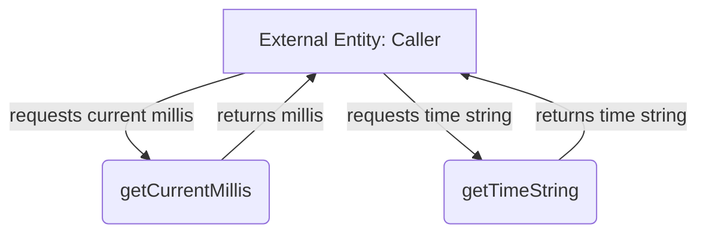

## Module: Time.java
- **模块名称**：Time.java

- **主要目标**：此模块的目的是提供与系统时间相关的实用功能，使得其他模块可以轻松地获取当前时间的毫秒值以及将时间戳转换为字符串格式。

- **关键函数**：
  - `getCurrentMillis()`：此方法返回当前时间的毫秒值。它使用了`System.currentTimeMillis()`方法，此为其核心功能。
  - `getTimeString(long time)`：此方法接受一个时间戳（长整型）作为参数，并返回该时间戳对应的字符串表示形式。它通过创建一个`Timestamp`对象并调用其`toString()`方法来实现。

- **关键变量**：由于此模块主要提供静态方法，不涉及成员变量的使用，因此没有特别的关键变量。

- **相互依赖性**：此模块主要依赖于Java标准库中的`System`类和`Timestamp`类来执行其功能，不直接与系统的其他自定义组件交互。

- **核心与辅助操作**：`getCurrentMillis()`方法可以视为核心操作，因为获取当前时间是许多应用中的基本需求。`getTimeString()`方法虽然重要，但相对而言更偏向辅助功能，用于格式化输出。

- **操作序列**：此模块不涉及复杂的操作序列或流程，其方法独立且直接，旨在被直接调用。

- **性能方面**：考虑到性能，此模块中的方法都是高效的。`System.currentTimeMillis()`是获取系统时间的标准且快速方式，而`Timestamp.toString()`在转换时间戳为字符串时也是效率较高的。

- **可重用性**：此模块高度通用，可在需要处理时间信息的任何Java应用中重用。其提供的功能是基础且普遍适用的。

- **使用**：此模块可用于记录日志、性能监控、事件时间戳生成等多种场景。任何需要获取当前时间或将时间戳转换为可读格式的功能都可能会用到它。

- **假设**：在设计此模块时，假设了系统的时间是准确且同步的。此外，还假设了使用此模块的环境能够支持Java标准库中的`System`和`Timestamp`类。
## Flow Diagram [via mermaid]

