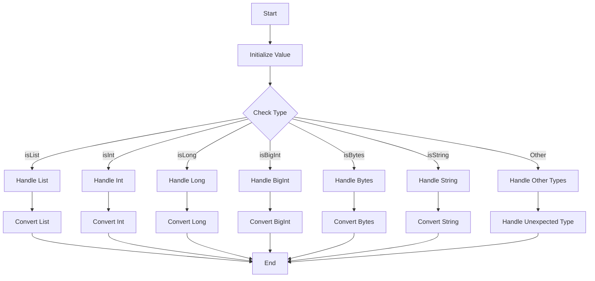

## Module: Value.java
由于您提供的代码是一个Java类，我将基于这个类提供一个综合分析：

- **模块名称**：Value.java

- **主要目标**：该类的目的是封装一个对象，并提供转换工具。

- **关键功能**：
  - `asObj()`：返回封装的对象。
  - `asList()`：如果封装的对象是数组，则将其转换为列表。
  - `asInt()`, `asLong()`, `asBigInt()`：将封装的对象转换为相应的数值类型。
  - `asString()`：将封装的对象转换为字符串。
  - `asBytes()`：将封装的对象转换为字节数组。
  - `get(int index)`：从列表中获取特定索引的值。
  - `cmp(Value o)`：比较两个`Value`对象是否相等。
  - 类型检查方法（`isList()`, `isString()`, `isInt()`, 等）：检查封装的对象的类型。
  
- **关键变量**：
  - `value`：被封装的对象。
  - `serializable`：序列化后的字节数组。
  - `sha3`：对象的SHA3哈希值。
  - `decoded`：标记对象是否已被解码。

- **互相依赖**：该类依赖于外部库（如`org.bouncycastle.util.encoders.Hex`和`com.cedarsoftware.util.DeepEquals`）来执行特定的操作，例如编码和深度比较。

- **核心与辅助操作**：核心操作包括类型转换和类型检查，辅助操作包括比较和哈希计算。

- **操作序列**：通常，操作序列取决于使用场景，但一般先进行类型检查，然后执行相应的转换操作。

- **性能方面**：性能考虑可能包括类型转换的效率和哈希计算的开销。

- **可重用性**：该类设计为高度通用，可在不同的上下文中重用，特别是在需要类型转换和封装对象的场景中。

- **使用**：这个类可以在需要对不同类型的数据进行封装和转换的地方使用，如在处理区块链数据结构时。

- **假设**：代码假设封装的对象可以是不同的类型，包括基本数据类型、数组、字符串等，并且提供了相应的方法来处理这些类型。

请注意，这个分析是基于代码片段的直接阅读，可能不完全准确，并且实际使用中还需考虑上下文。
## Flow Diagram [via mermaid]

