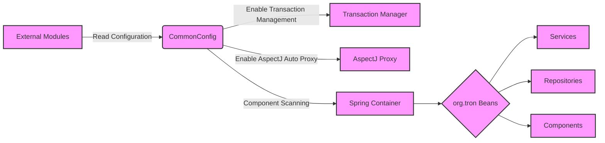

## Module: CommonConfig.java
**模块名称**：CommonConfig.java

**主要目标**：该模块的主要目的是配置Spring框架的各种常见属性和功能，为Tron项目提供基础配置。

**关键函数**：
- 由于这是一个配置类，它主要通过注解来指导Spring框架的行为，而不是通过传统的函数或方法。关键注解包括：
  - `@Configuration`：标识这个类作为项目配置的一部分。
  - `@EnableTransactionManagement`：启用Spring的注解驱动的事务管理功能。
  - `@EnableAspectJAutoProxy`：允许使用AspectJ自动代理。
  - `@ComponentScan`：指定Spring在初始化时应该扫描哪些包以查找注解组件。

**关键变量**：由于这是一个配置类，它不包含传统意义上的变量。其关键性在于它通过注解声明了配置信息。

**相互依赖性**：该模块依赖于Spring框架的相关组件，特别是与Spring的事务管理和AOP（面向切面编程）功能相关的组件。

**核心与辅助操作**：
- 核心操作：配置Spring框架的基本行为，如事务管理和组件扫描。
- 辅助操作：通过`@EnableAspectJAutoProxy`支持面向切面编程，虽然这可以视为高级功能，但对于确保模块化和关注点分离至关重要。

**操作序列**：作为配置类，它不直接参与操作序列，但它在应用启动时被Spring框架读取和处理，以设置应用的运行环境。

**性能方面**：直接影响性能的因素较少，因为它主要负责配置。然而，其配置的效率和准确性将影响到整个应用的性能。

**可重用性**：这个配置类特定于Tron项目，但是其模式和方法可以被应用到需要类似Spring框架配置的其他项目中。

**使用**：在Tron项目中，这个模块被用来初始化和配置Spring框架，确保框架的各项功能如预期般工作。

**假设**：
- 假设开发者熟悉Spring框架及其注解。
- 假设项目结构符合Spring的期望，特别是与`@ComponentScan`注解指定的包路径相关。

这个模块展示了如何利用Spring框架的强大功能来简化Java应用的配置和管理。通过注解，它声明了项目所需的关键配置，使得项目结构更加清晰，且易于维护。
## Flow Diagram [via mermaid]

