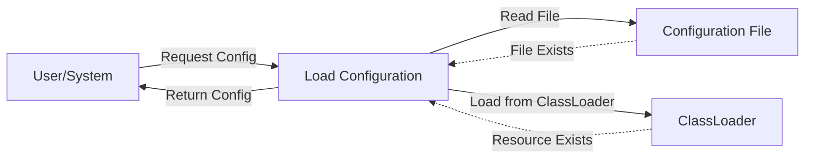

## Module: Configuration.java
- **模块名称**：Configuration.java

- **主要目标**：该模块的目的是为了提供一个配置文件的加载机制，允许从指定路径加载配置信息，支持以太坊J(ethereumJ)库的配置需求。

- **关键功能**：
  - `getByFileName`：根据给定的路径加载配置文件。如果指定的是外部配置文件路径，则尝试从该路径加载；如果未指定或找不到，尝试从类路径加载。

- **关键变量**：
  - `config`：一个`com.typesafe.config.Config`对象，用于存储加载的配置信息。

- **依赖关系**：
  - 该模块依赖于`com.typesafe.config.ConfigFactory`来解析配置文件。
  - 依赖于Apache的`StringUtils`进行字符串判断。

- **核心与辅助操作**：
  - 核心操作是配置的加载和解析（通过`getByFileName`方法）。
  - 辅助操作包括路径的合法性检查和错误处理。

- **操作顺序**：
  1. 检查外部配置文件路径是否指定且非空。
  2. 如果指定，尝试从该路径加载配置。
  3. 如果未指定或加载失败，检查内部配置路径是否非空。
  4. 尝试从内部路径或类路径加载配置。
  5. 如果找不到配置文件，抛出异常。

- **性能方面**：
  - 性能考虑主要集中在配置加载的效率上。使用缓存的`config`对象避免重复加载。

- **可重用性**：
  - 该模块设计为通用配置加载工具，可适用于不同的配置文件和环境，具有较高的可重用性。

- **使用**：
  - 主要用于以太坊J(ethereumJ)库和其他需要动态加载配置文件的应用程序。

- **假设**：
  - 假设配置文件的路径正确且文件格式合法。
  - 假设调用者正确处理加载失败的情况。
## Flow Diagram [via mermaid]

