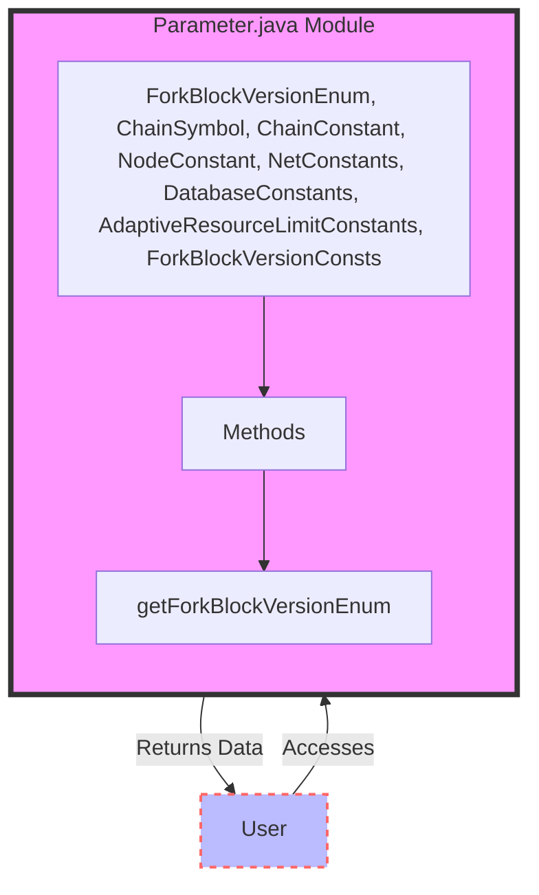

## Module: Parameter.java
基于提供的代码模块，以下是用中文进行的综合分析：

- **模块名称**：Parameter.java

- **主要目标**：该模块的目的是定义与Tron区块链参数相关的枚举、常量和配置，包括分叉版本、链符号、链常量、节点常量、网络常量、数据库常量以及自适应资源限制常量等。

- **关键功能**：
  - `ForkBlockVersionEnum`：枚举不同的分叉版本和相关属性（版本值、硬分叉时间、硬分叉率）。
  - `ChainSymbol`：定义TRX的符号。
  - `ChainConstant`：定义链的基本常量，如最大活跃见证人数、转账费用、出块间隔等。
  - `NodeConstant`、`NetConstants`、`DatabaseConstants`、`AdaptiveResourceLimitConstants`：分别定义了节点、网络、数据库和自适应资源限制的相关常量。

- **关键变量**：
  - 分叉版本的时间戳和升级率（例如，`VERSION_4_0_1`的时间戳和升级率）。
  - 链常量中的各种配置参数，如`MAX_ACTIVE_WITNESS_NUM`、`BLOCK_PRODUCED_INTERVAL`等。

- **交互依赖**：此模块主要提供了一系列的常量和枚举，供系统的其他部分引用，以便在整个Tron区块链系统中保持参数的一致性。

- **核心与辅助操作**：定义枚举和常量是核心操作，因为它们为区块链的运行提供了基本参数。辅助操作可能包括为特定版本或功能获取相应枚举值的方法。

- **操作顺序**：此模块主要是定义和初始化，没有特定的操作顺序。

- **性能方面**：此模块主要涉及静态数据的定义，对性能的直接影响较小，但正确配置这些参数对于系统的整体性能和稳定性至关重要。

- **可重用性**：由于定义的是基本的系统参数和枚举，这些定义在多个地方被引用和复用，具有很高的可重用性。

- **使用**：系统的其他部分（如交易处理、区块生成、资源限制管理等）会使用这些参数来确保操作的一致性和正确性。

- **假设**：在设计这个模块时，假设了区块链的运行参数（如分叉版本、出块间隔等）是预先确定且在整个系统中一致的。

通过这个模块，Tron区块链能够维护其操作的一致性和稳定性，同时为开发者提供了一个清晰的参数和配置的参考。
## Flow Diagram [via mermaid]

