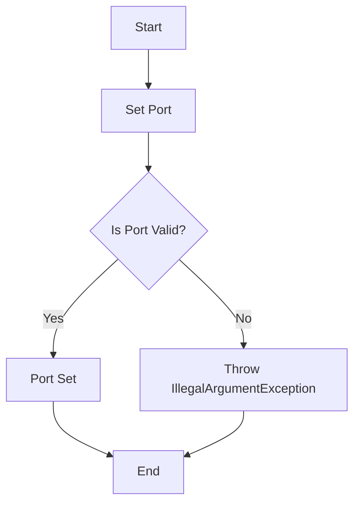

## Module: Overlay.java
- **模块名称**：Overlay.java

- **主要目标**：该模块的目的是定义和管理网络端口设置，确保端口号在有效范围内。

- **关键功能**：
  - `setPort(final int port)`: 这是该类的主要方法，用于设置网络监听端口。它接受一个整数参数`port`，并检查该端口是否在有效范围内（0到65535）。如果不在此范围内，将抛出`IllegalArgumentException`异常。

- **关键变量**：
  - `private int port`: 这是一个私有变量，用于存储网络监听端口的值。

- **相互依赖性**：虽然此代码段未直接展示与其他系统组件的交互，但可以推断`Overlay`类可能是网络配置或网络服务组件的一部分，与网络通信和配置管理相关的其他类有交互。

- **核心与辅助操作**：在此代码段中，设置端口的操作是核心功能，因为没有展示其他辅助操作或功能。

- **操作序列**：操作相对简单，仅包括通过`setPort`方法接收端口号，验证该端口号是否在指定范围内，然后将其赋值给内部变量。

- **性能方面**：性能考虑主要集中于确保端口号的有效性，通过使用`Range`类来快速检查端口号是否在预期范围内，从而避免无效的端口配置。

- **可重用性**：`Overlay`类展示了良好的封装性和简单的接口，使其容易在需要端口配置的其他组件或应用中重用。

- **使用**：该类可用于任何需要设置和验证网络监听端口的场景，特别是在需要确保端口配置符合特定规则的网络应用中。

- **假设**：
  - 假设端口号的有效范围是0到65535，这是基于网络端口号的标准范围。
  - 假设在端口号无效时抛出异常是合适的错误处理方式，这要求调用者捕获并处理这种异常。
## Flow Diagram [via mermaid]

