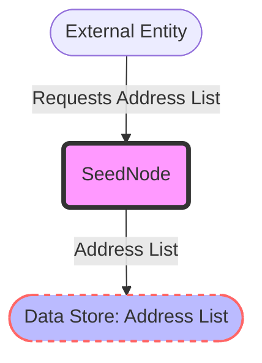

## Module: SeedNode.java
- **模块名称**：SeedNode.java

- **主要目标**：该模块的目的是管理种子节点（Seed Node）的地址信息。种子节点是网络中预先配置好的节点，新加入的节点可以通过它们获取网络中其他节点的信息。

- **关键功能**：
  - `getAddressList`：获取种子节点地址列表的方法。
  - `setAddressList`：设置种子节点地址列表的方法。

- **关键变量**：
  - `addressList`：这是一个`List<InetSocketAddress>`类型的变量，存储种子节点的地址信息。

- **依赖关系**：虽然从提供的代码中直接看不出与其他系统组件的具体交互，但可以推测这个模块可能会与网络连接管理相关的其他模块有交互，例如在初始化网络连接时使用种子节点的地址信息。

- **核心与辅助操作**：在这个简单的类中，设置和获取地址列表的操作是核心操作，因为它们直接关系到种子节点信息的管理。没有明显的辅助操作。

- **操作顺序**：通常，首先会通过`setAddressList`方法设置种子节点的地址，随后可以在需要时通过`getAddressList`方法获取这些地址。

- **性能方面**：性能考虑可能不是这个类的主要关注点，因为它主要负责存储和提供访问种子节点地址的功能。然而，地址列表的管理效率（如何快速检索和更新地址信息）可能会影响到使用它的系统部分的性能。

- **可重用性**：这个类设计得相对简单，使得它可以很容易地在需要管理种子节点地址信息的任何场景下重用。

- **使用**：在区块链网络或类似的分布式系统中，新节点加入网络时，可能会使用`SeedNode`类的实例来获取已知的、可信的种子节点列表，以帮助它们快速地与网络中的其他节点建立连接。

- **假设**：该类的设计似乎假设了种子节点的地址信息是通过某种方式事先确定并可以被静态配置的。此外，还假设了使用这个类的系统需要以某种方式处理网络地址，特别是使用`InetSocketAddress`这一特定的数据结构来表示地址。
## Flow Diagram [via mermaid]

