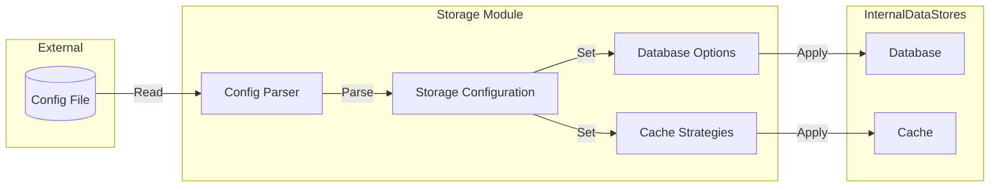

## Module: Storage.java
**模块名称**：Storage.java

**主要目标**：此模块的目的是为java-tron项目提供自定义存储配置功能，包括数据库引擎、同步机制、索引存储、事务历史记录开关等的配置。

**关键功能**：
- 配置存储选项（包括数据库目录、引擎、同步配置等）
- 设置和获取缓存策略
- 创建和管理数据库属性
- 从配置文件中加载和设置数据库相关配置

**关键变量**：
- `dbDirectory`, `dbEngine`, `dbSync`：分别用于存储数据库目录、数据库引擎和数据库同步配置。
- `indexDirectory`, `indexSwitch`：用于存储索引目录和索引开关配置。
- `cacheStrategies`, `propertyMap`：缓存策略映射和数据库属性映射。

**相互依赖性**：
- 与`org.tron.common.utils.DbOptionalsUtils`和`org.tron.common.cache.CacheStrategies`等类相互作用，用于处理数据库选项和缓存策略。
- 依赖于`com.typesafe.config`库来加载和解析配置文件。

**核心与辅助操作**：
- 核心操作包括设置和获取数据库配置、缓存策略。
- 辅助操作包括从配置文件中加载配置、创建数据库属性等。

**操作序列**：
1. 从配置文件加载数据库和缓存相关配置。
2. 根据加载的配置设置数据库存储目录、引擎、同步选项等。
3. 设置缓存策略。
4. 创建数据库属性映射，用于后续数据库操作。

**性能方面**：
- 通过配置不同的数据库引擎和同步选项，可以对性能产生影响。
- 缓存策略的配置对于提高数据访问速度也至关重要。

**可重用性**：
- 此模块设计有较高的可重用性，可以通过修改配置文件来适应不同的存储需求。

**使用**：
- 在java-tron项目中，通过配置文件`config.conf`来使用此模块，以实现自定义的存储需求。

**假设**：
- 假设用户已经有了基本的数据库和文件系统知识。
- 假设配置文件是正确格式化和配置的。
## Flow Diagram [via mermaid]

