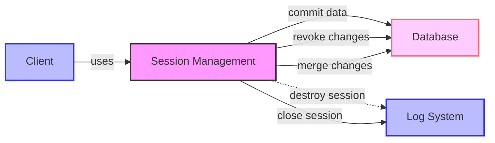

## Module: ISession.java
- **模块名称**：ISession.java

- **主要目标**：该接口定义了一个会话（Session）的基本操作，用于管理数据库操作的事务性质，确保数据的一致性和完整性。

- **关键函数**：
  - `commit()`：提交当前会话中的所有更改，确保所有更改永久保存到数据库。
  - `revoke()`：撤销当前会话中的所有更改，回滚到事务开始前的状态。
  - `merge()`：将当前会话的更改合并到主数据库中，通常用于临时更改的确认。
  - `destroy()`：销毁会话，释放相关资源。
  - `close()`：关闭会话，可能包括提交或回滚操作，确保所有资源得到适当释放。

- **关键变量**：由于这是一个接口，直接定义中不包含变量，但实现该接口的类将包含管理数据库连接和事务状态的关键变量。

- **交互依赖**：该接口与数据库管理系统（DBMS）及其它数据库操作类紧密相关，实现该接口的类需要与数据库连接、事务管理等组件交云。

- **核心与辅助操作**：
  - 核心操作包括`commit()`和`revoke()`，它们直接影响事务的完成与否。
  - 辅助操作包括`merge()`、`destroy()`和`close()`，它们用于管理会话生命周期和资源释放。

- **操作序列**：通常的流程是：创建会话 -> 执行数据库操作 -> 调用`commit()`或`revoke()`提交或撤销更改 -> 调用`close()`结束会话。

- **性能方面**：性能考虑包括事务管理的效率、资源使用和释放的优化等。实现该接口的类需要高效管理数据库连接和事务，以最小化资源消耗和响应时间。

- **可重用性**：该接口定义了通用的数据库会话操作，使得不同的数据库操作类可以通过实现此接口来统一事务管理方式，提高代码的可重用性和模块化。

- **使用**：在需要事务性数据库操作的场景中使用，通过实现该接口，开发者可以自定义会话管理逻辑，以适应不同的数据库操作需求。

- **假设**：假设存在一个稳定的数据库管理系统，且实现该接口的类能够正确管理数据库连接和事务状态。此外，还假设调用者正确地使用`commit()`、`revoke()`和`close()`方法来管理事务生命周期。
## Flow Diagram [via mermaid]

