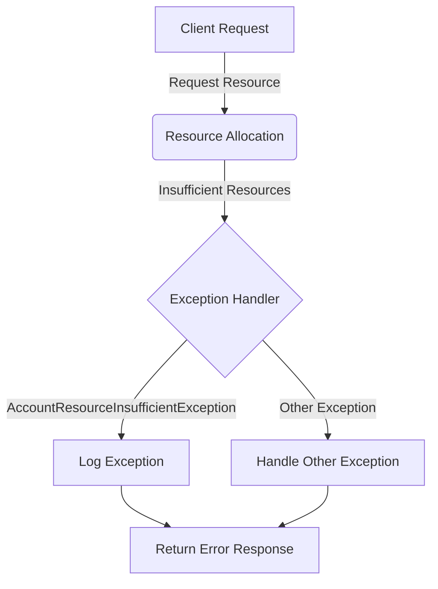

## Module: AccountResourceInsufficientException.java
- **模块名称**：AccountResourceInsufficientException.java
- **主要目标**：该模块的目的是定义一个特定的异常，用于处理Tron区块链平台中账户资源不足的情况。这种异常通常在用户尝试进行交易或执行合约时，账户的资源（如带宽、能量等）不足以完成操作时抛出。
- **关键函数**：
  - 构造函数`AccountResourceInsufficientException(String message)`：接收一个字符串参数`message`，该参数用于描述资源不足的具体信息或原因。
- **关键变量**：无直接变量，但构造函数使用的`message`参数是关键信息载体，用于传达异常的详细信息。
- **相互依赖性**：作为`TronException`的子类，该模块依赖于Tron区块链平台的异常处理机制。它可能与账户管理、交易执行等其他系统组件交互，以在资源不足时抛出异常。
- **核心与辅助操作**：该模块的核心操作是通过其构造函数创建异常实例。没有明显的辅助操作，因为它主要关注于异常的定义和抛出。
- **操作序列**：在账户资源不足的情况下，系统或应用尝试执行操作（如交易或合约执行）时，会实例化并抛出`AccountResourceInsufficientException`，随后被异常处理机制捕获和处理。
- **性能方面**：作为一个异常类，其对性能的直接影响相对较小，主要性能考虑是确保异常能够被有效捕获和处理，避免程序崩溃。
- **可重用性**：由于该异常类针对的是特定于Tron平台的资源不足情况，其可重用性主要局限于Tron区块链或需要处理类似资源管理问题的系统中。
- **使用**：当Tron平台上的账户在执行某些操作时资源不足，系统会抛出`AccountResourceInsufficientException`。开发者需要在相关代码中处理这个异常，以提供错误信息给用户或采取其他补救措施。
- **假设**：该模块的设计假设是Tron区块链平台中存在资源管理机制，且系统能够检测到各种资源的使用情况，当资源不足时能够准确地抛出和处理这一异常。
## Flow Diagram [via mermaid]

