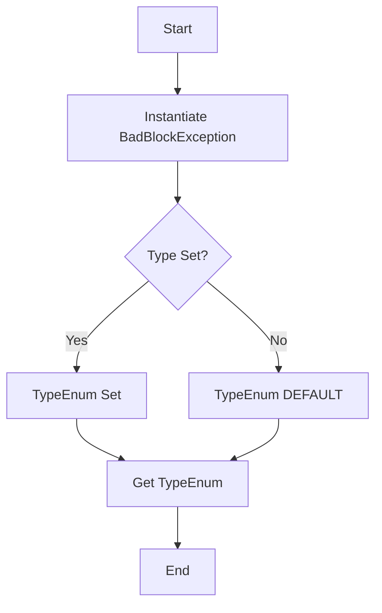

## Module: BadBlockException.java
- **模块名称**: BadBlockException.java

- **主要目标**: 此模块的目的是定义一个特定的异常类，用于处理Tron区块链框架中与“坏块”相关的异常情况。这些异常可能包括但不限于计算默克尔根失败或其他与区块验证或处理相关的错误。

- **关键函数**:
  - `BadBlockException()`: 无参构造函数，创建一个带有默认错误消息的异常实例。
  - `BadBlockException(String message)`: 带有自定义错误消息的构造函数。
  - `BadBlockException(TypeEnum type, String message)`: 允许指定错误类型和自定义消息的构造函数。
  - `getType()`: 返回异常类型的方法。

- **关键变量**:
  - `TypeEnum type`: 枚举，指示异常的具体类型，如计算默克尔根失败或默认类型。

- **相互依赖性**: 此异常类主要与Tron区块链框架中处理区块的其他组件相互作用，尤其是在区块验证和处理过程中遇到错误时。

- **核心与辅助操作**: 核心操作包括异常的创建和类型的指定。辅助操作可能包括错误消息的定制和异常类型的获取。

- **操作序列**: 一般在检测到坏块情况时，会创建并抛出`BadBlockException`，可能会附带具体的错误类型和消息，以便于问题的诊断和处理。

- **性能方面**: 作为一个异常类，性能考虑不是主要焦点，但是合理使用异常可以帮助保持代码的清晰度和易于维护性。

- **可重用性**: 由于这是一个针对特定错误情况设计的异常类，其可重用性主要限于Tron区块链框架或类似的区块链项目中处理块验证和处理错误的上下文。

- **使用**: 在Tron区块链框架中，当区块验证或处理过程中遇到无法正常处理的错误时，会使用此异常类来标识和报告问题。

- **假设**: 在设计此异常类时，假设开发者或维护者具有足够的背景知识来理解不同异常类型的含义，并据此采取相应的错误处理措施。
## Flow Diagram [via mermaid]

