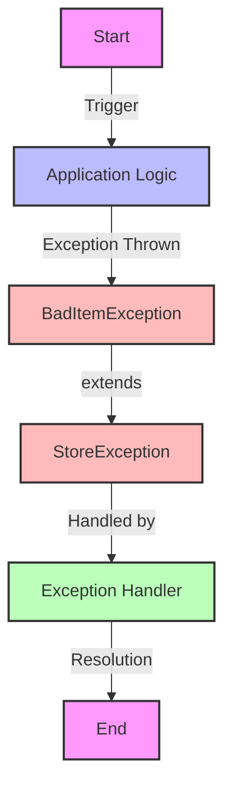

## Module: BadItemException.java
- **模块名称**：BadItemException.java

- **主要目标**：该模块的目的是定义一个特定的异常类型，用于处理在Tron区块链框架中与存储相关的异常情况，特别是处理不良项目（Bad Item）时遇到的问题。

- **关键函数**：
  - `BadItemException()`：一个无参构造函数，创建一个基本的异常实例。
  - `BadItemException(String message)`：带有详细错误信息的构造函数，用于提供关于异常的更多上下文。
  - `BadItemException(String message, Throwable cause)`：带有错误信息和导致异常的原因的构造函数，用于深入追踪异常。

- **关键变量**：无直接的变量，但构造函数参数`message`和`cause`是关键的信息载体。

- **相互依赖性**：作为`StoreException`的子类，`BadItemException`与系统中负责数据存储和处理的其他组件有间接关联，特别是那些可能抛出或处理此类异常的组件。

- **核心与辅助操作**：该模块主要提供异常处理机制，核心操作是异常的构造和初始化。没有明显的辅助操作。

- **操作序列**：在检测到不良项目或存储相关错误时，可以创建并抛出`BadItemException`实例，随后可能被上层逻辑捕获和处理。

- **性能方面**：作为异常处理机制的一部分，该模块对性能的直接影响较小，但设计良好的异常处理流程可以帮助保持系统的健壯性和稳定性。

- **可重用性**：由于是专门针对特定异常情况设计的异常类，其可重用性主要限于处理Tron区块链框架中相似的存储或项目错误情况。

- **使用**：在Tron区块链框架的存储系统遇到不合规或无法处理的项目时，可以使用`BadItemException`来标识和报告这些问题。

- **假设**：该模块的设计和使用基于假设，系统中存在一套异常处理机制来适当地捕获和处理这类异常，且开发者了解何时以及如何使用这个异常类来标识特定的错误情况。
## Flow Diagram [via mermaid]

