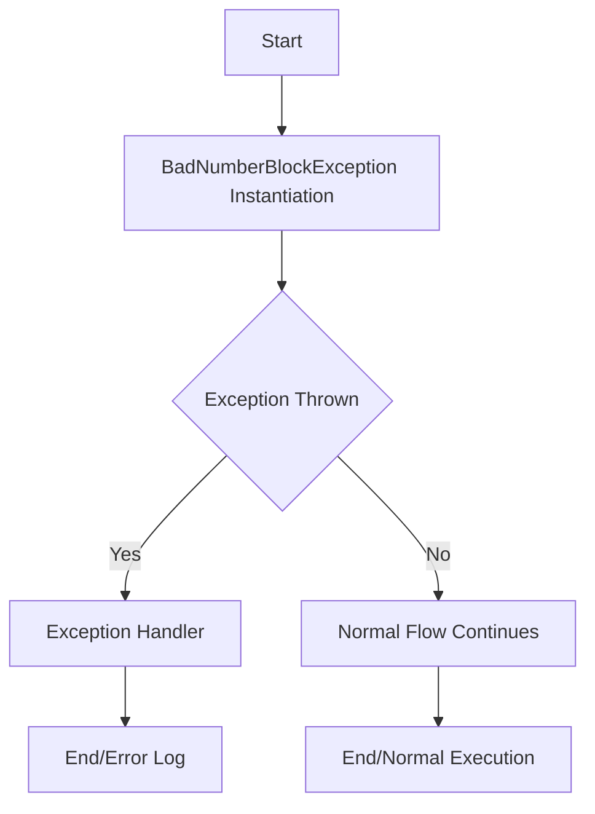

## Module: BadNumberBlockException.java
- **模块名称**：BadNumberBlockException.java

- **主要目标**：该模块的目的是定义一个特定的异常类型——BadNumberBlockException，它是用来表示在Tron区块链框架中发生的与“块号”相关的异常情况。这个异常类扩展了TronException，表明它是Tron框架特有的异常类型之一。

- **关键函数**：
  - `BadNumberBlockException()`：一个无参数的构造函数，创建一个基本的异常实例。
  - `BadNumberBlockException(String message)`：带有详细错误信息的构造函数，允许在抛出异常时提供更多的上下文信息。

- **关键变量**：由于这是一个异常类，其主要的“变量”实际上是构造函数中的`message`参数，它存储了关于异常的详细信息。

- **相互依赖性**：作为TronException的子类，BadNumberBlockException依赖于其父类的实现。同时，它可能会被Tron区块链框架中处理块号相关操作的其他组件所引用和抛出。

- **核心与辅助操作**：在这个异常类中，没有明确的核心与辅助操作之分。其主要操作是通过构造函数提供异常的创建和异常信息的初始化。

- **操作序列**：在使用时，首先是通过调用其中一个构造函数实例化异常，然后在适当的上下文中（如当检测到无效的块号时）抛出该异常。

- **性能方面**：作为一个异常类，其性能影响主要取决于它被抛出的频率。通常，异常处理不应该是程序中的常规控制流程，因此，如果频繁抛出BadNumberBlockException，可能需要检查系统以确定是否存在更深层次的问题。

- **可重用性**：BadNumberBlockException作为一个特定于Tron框架的异常类，其可重用性主要局限于该框架或需要处理类似异常的系统中。

- **使用**：当Tron区块链框架中的某个组件在处理块号时遇到不合法或预期之外的情况，可以抛出BadNumberBlockException来中断当前操作并通知上层调用者该异常情况。

- **假设**：实现这个异常类的一个基本假设是，Tron框架的使用者需要对块号相关的异常情况有一个明确和特定的反馈机制。此外，假设使用者能够理解和处理这种类型的异常。
## Flow Diagram [via mermaid]

