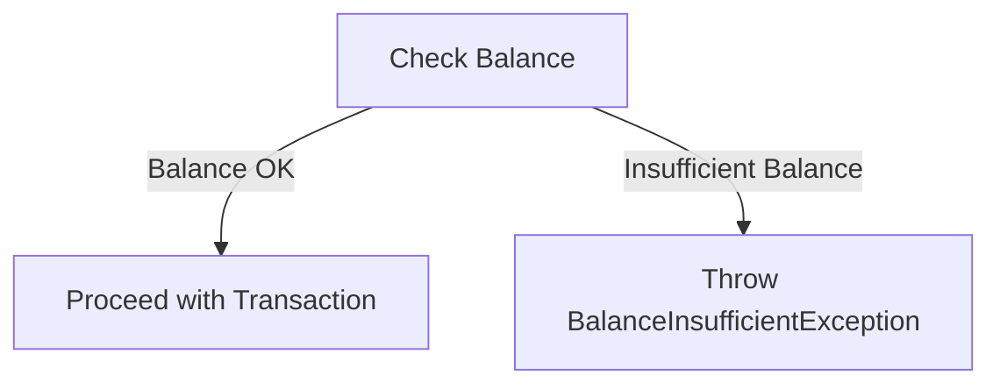

## Module: BalanceInsufficientException.java
- **模块名称**: BalanceInsufficientException.java

- **主要目标**: 该模块的目的是定义一个特定的异常，用于处理在Tron区块链平台上执行交易或其他操作时出现的余额不足错误。

- **关键功能**:
  - `BalanceInsufficientException()`: 一个无参构造方法，用于创建一个不带消息的异常实例。
  - `BalanceInsufficientException(String message)`: 一个带有详细错误信息的构造方法，允许在抛出异常时提供更多上下文。

- **关键变量**: 由于这是一个异常类，其主要变量是继承自父类`TronException`的消息字符串，该字符串存储了异常的详细信息。

- **相互依赖性**: 该模块依赖于其父类`TronException`，后者可能进一步继承自Java的`Exception`类。它可能被Tron区块链平台的交易处理模块或余额检查逻辑所使用。

- **核心与辅助操作**: 核心操作是通过构造方法提供异常的创建和初始化。没有明显的辅助操作，因为这是一个相对简单的异常类。

- **操作序列**: 在检测到余额不足的情况下，可能会创建并抛出`BalanceInsufficientException`实例，这通常是在执行交易或资金转移操作的过程中。

- **性能方面**: 作为一个异常类，其性能影响主要取决于它被抛出的频率。频繁抛出异常可能会对应用性能产生负面影响，但在正常情况下，异常应被视为异常控制流的一部分，不应频繁发生。

- **可重用性**: 由于这个异常类是专门为处理Tron区块链上的余额不足错误而设计的，其可重用性主要局限于Tron平台或需要处理类似错误的区块链应用中。

- **使用**: 当Tron平台上的操作因为账户余额不足而无法继续时，可以使用此异常类来通知调用者或处理错误。

- **假设**: 实现这个异常类的假设是，在Tron区块链平台上进行操作时，存在账户余额检查机制，并且在余额不足以完成操作时需要适当的错误处理机制。
## Flow Diagram [via mermaid]

