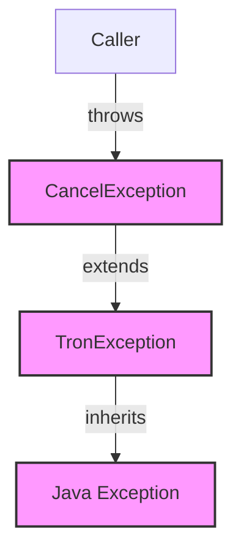

## Module: CancelException.java
- **模块名称**：CancelException.java
- **主要目标**：该模块的目的是定义一个特定于Tron区块链项目的异常，用于处理取消操作时可能出现的异常情况。
- **关键函数**：
  - `CancelException()`：一个无参构造函数，创建一个基本的异常实例。
  - `CancelException(String message)`：带有详细错误信息的构造函数，允许在抛出异常时提供更多上下文。
- **关键变量**：该模块中没有明显的关键变量，因为它主要定义了异常类型。
- **相互依赖性**：作为Tron区块链项目的一部分，`CancelException`可能与其他处理区块链操作和异常处理的模块相互作用，但具体依赖关系取决于项目的其他部分如何使用此异常。
- **核心与辅助操作**：该模块主要提供异常处理机制，因此所有操作都是核心操作，旨在提供一致的异常处理方式。
- **操作序列**：在正常使用中，当检测到取消操作或条件时，可能会抛出`CancelException`，但它本身不定义特定的操作序列。
- **性能方面**：作为一个异常类，`CancelException`对性能的影响相对较小，主要取决于它被抛出的频率以及异常处理机制的效率。
- **可重用性**：由于`CancelException`是针对Tron项目中取消操作的特定异常，它的可重用性主要局限于该项目或需要类似异常处理机制的类似区块链项目。
- **使用**：在Tron项目中，当一个操作需要被取消，而这种取消状态需要被明确表达和处理时，可以使用`CancelException`。
- **假设**：开发此模块的一个基本假设是，Tron项目中存在取消操作的情况，且需要通过异常处理机制来优雅地处理这些情况。

这个分析基于模块的定义和功能进行了概述，但具体的实现细节和使用场景可能需要查阅更多Tron项目的文档和代码来获得。
## Flow Diagram [via mermaid]

