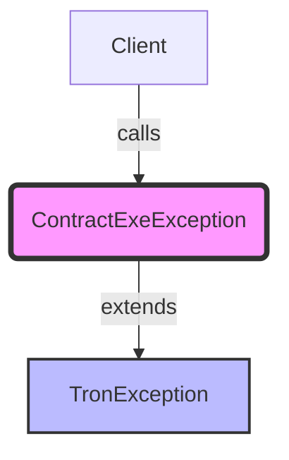

## Module: ContractExeException.java
- **模块名称**：ContractExeException.java

- **主要目标**：此模块的目的是定义一个特定的异常类型——ContractExeException，用于处理与智能合约执行相关的异常情况。

- **关键函数**：
  - `ContractExeException()`：无参构造函数，创建一个基本的异常实例。
  - `ContractExeException(String message)`：带有详细错误信息的构造函数，允许在创建异常时附加具体的描述信息。

- **关键变量**：没有特定的变量，因为这个类主要是通过其构造函数来传递异常信息。

- **相互依赖性**：作为TronException的子类，ContractExeException依赖于其父类的实现细节，特别是继承了父类的异常处理机制。

- **核心与辅助操作**：此模块主要关注点是异常的定义和初始化（核心操作），没有明显的辅助操作。

- **操作序列**：通常，当智能合约执行过程中遇到不符合预期的情况时，将创建并抛出ContractExeException异常。

- **性能方面**：作为一个异常类，ContractExeException的性能考虑主要集中在异常创建和抛出的开销上，但这通常是可忽略的，除非异常处理不当（如过度使用）。

- **可重用性**：由于这是一个特定于Tron智能合约执行的异常类，其可重用性主要限于Tron区块链平台或需要处理类似异常的系统中。

- **使用**：在智能合约执行过程中，当遇到不符合预期的行为或错误时，可以抛出ContractExeException，以便调用者可以捕获并适当处理这些异常情况。

- **假设**：在设计此异常类时，假设用户或开发者熟悉Java异常处理机制，并且理解Tron智能合约的基本概念和执行流程。

通过定义和使用特定的异常类型，如ContractExeException，可以更精确地识别和处理智能合约执行过程中的特定错误情况，有助于提高代码的可读性和维护性。
## Flow Diagram [via mermaid]

