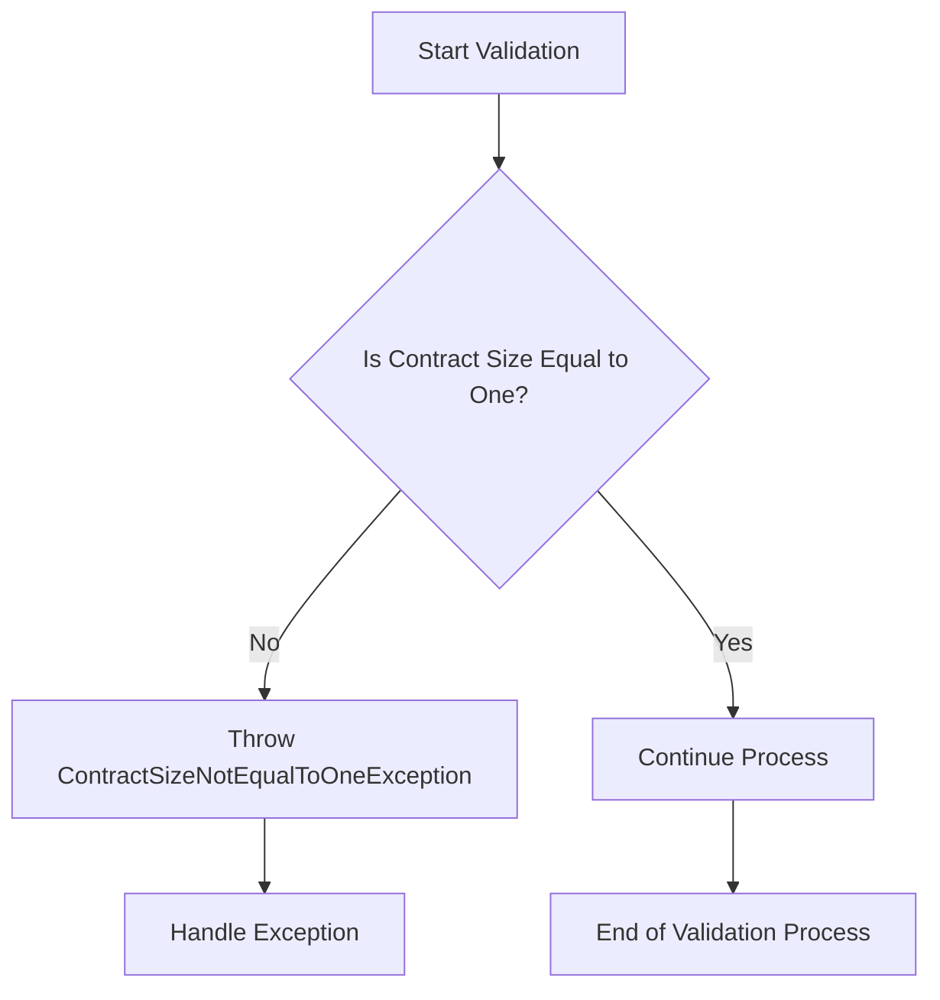

## Module: ContractSizeNotEqualToOneException.java
- **模块名称**: ContractSizeNotEqualToOneException.java

- **主要目标**: 该模块的目的是定义一个特定的异常，用于处理合约验证过程中遇到的特定错误情况，即合约大小不等于1的情况。

- **关键函数**:
  - `ContractSizeNotEqualToOneException()`: 无参构造函数，创建一个基本的异常实例。
  - `ContractSizeNotEqualToOneException(String message)`: 带有详细错误信息的构造函数，允许传递具体的错误描述。

- **关键变量**: 由于这是一个异常类，其主要变量是通过构造函数传递的错误消息`message`。

- **交互依赖**:
  - 该异常类继承自`ContractValidateException`，这表明它是特定于合约验证错误的一种类型。
  - 它可能与系统中负责合约验证的其他组件交云，特别是在合约大小校验不通过时抛出此异常。

- **核心与辅助操作**:
  - 核心操作是异常的构造和错误消息的传递。
  - 该模块没有明显的辅助操作。

- **操作序列**: 
  - 在合约验证过程中，如果检测到合约的大小不等于1，将抛出`ContractSizeNotEqualToOneException`异常。

- **性能方面**:
  - 作为一个异常类，它的性能影响主要取决于异常处理机制的效率以及异常发生的频率。

- **可重用性**:
  - 该异常类是高度专用的，但它可以在任何需要标识和处理合约大小校验失败情况的地方重用。

- **使用**:
  - 在合约验证逻辑中，当发现合约大小不符合预期（即不等于1）时，使用此异常类来标识和报告错误。

- **假设**:
  - 该异常类的设计基于一个假设，即合约的大小在某些场景下必须严格等于1。这可能反映了特定的业务规则或合约逻辑要求。
## Flow Diagram [via mermaid]

