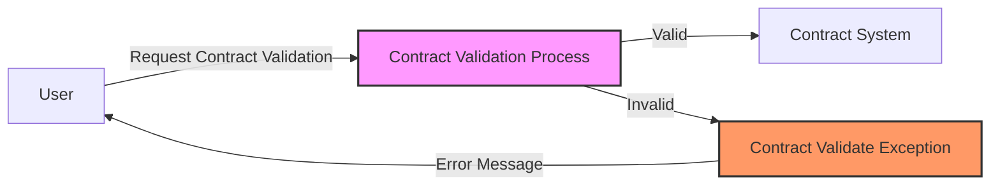

## Module: ContractValidateException.java
- **模块名称**: ContractValidateException.java

- **主要目标**: 此模块的目的是定义一个特定的异常类，用于处理智能合约验证过程中出现的异常情况。它是Tron区块链平台上智能合约开发和执行的一部分，用于指示合约验证失败的错误。

- **关键功能**:
  - `ContractValidateException()`: 一个无参构造方法，创建一个基本的异常实例。
  - `ContractValidateException(String message)`: 接受一个字符串参数的构造方法，用于创建包含错误消息的异常实例。
  - `ContractValidateException(String message, Throwable throwable)`: 接受一个错误消息和一个可抛出对象的构造方法，用于创建包含详细错误信息和原因的异常实例。

- **关键变量**: 由于这是一个异常类，主要的"变量"是传递给构造方法的错误消息和原因（如果有的话），这些信息用于初始化父类`TronException`。

- **相互依赖性**: 该模块依赖于其父类`TronException`，后者可能是一个更通用的异常类，用于表示Tron平台上的错误。此外，它可能被智能合约的验证逻辑所使用，这意味着它与智能合约模块有直接的关系。

- **核心与辅助操作**: 核心操作包括异常的创建和初始化。没有明确的辅助操作，因为这是一个专门用于表示错误状态的异常类。

- **操作序列**: 在智能合约验证失败时，可能会创建并抛出`ContractValidateException`实例，这通常发生在智能合约的执行流程中的特定点。

- **性能方面**: 作为一个异常类，性能考虑不是主要关注点。然而，异常的创建和抛出应该是高效的，避免在合约验证过程中引入不必要的开销。

- **可重用性**: 由于这是一个特定于智能合约验证失败情况的异常类，其重用性可能主要限于智能合约和相关功能的上下文中。不过，它遵循Java异常类的标准模式，易于理解和使用。

- **使用方式**: 当智能合约的验证逻辑发现合约状态或输入不满足预期条件时，可以抛出`ContractValidateException`。这通常用于通知调用者合约验证失败，并提供失败的原因。

- **假设**: 
  - 假设智能合约的验证逻辑是必要的，且可能失败。
  - 假设调用者需要明确的错误信息来处理验证失败的情况。
  - 假设在Tron区块链平台上执行智能合约时，异常处理是一种有效的错误通知机制。
## Flow Diagram [via mermaid]

