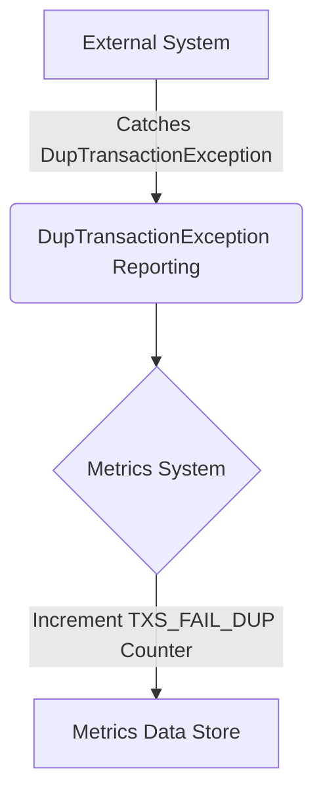

## Module: DupTransactionException.java
- **模块名称**：DupTransactionException.java

- **主要目标**：该模块的目的是定义一个特定的异常类，用于处理在Tron区块链平台上发生的重复交易异常情况。

- **关键函数**：
  - `DupTransactionException()`：一个无参构造方法，创建一个基本的异常实例。
  - `DupTransactionException(String message)`：带有详细错误信息的构造方法，用于创建一个包含特定错误信息的异常实例。
  - `report()`：一个受保护的方法，用于在发生重复交易异常时，通过Prometheus指标系统记录该事件。

- **关键变量**：无直接的变量，但构造方法中的`String message`用于传递异常信息。

- **依赖关系**：
  - 与`org.tron.common.prometheus.Metrics`类交互，使用其`counterInc`方法来增加特定的计数器，用于监控和报告重复交易的失败事件。
  - 依赖于`MetricKeys`和`MetricLabels`类来指定更新的指标和标签。

- **核心与辅助操作**：
  - 核心操作是通过构造方法创建异常实例，并通过`report`方法记录事件。
  - 该模块没有明显的辅助操作。

- **操作序列**：当检测到重复交易时，首先通过构造方法实例化异常，然后调用`report`方法来记录该事件。

- **性能方面**：该模块的性能考虑主要集中在异常处理和事件记录的效率上。使用Prometheus进行事件记录可能会引入额外的性能开销，但对于监控和诊断问题是必要的。

- **可重用性**：该异常类是特定于Tron区块链平台处理重复交易的情况设计的，但其模式和实现可以在需要处理类似异常情况的其他系统中复用。

- **使用**：在Tron区块链平台的代码中，当检测到一个重复的交易尝试时，会抛出`DupTransactionException`异常，并通过调用其`report`方法来记录这一事件。

- **假设**：
  - 假设系统已经集成了Prometheus指标系统，能够处理和记录指标事件。
  - 假设系统能够正确识别重复的交易，以便在适当的时机抛出此异常。
## Flow Diagram [via mermaid]

