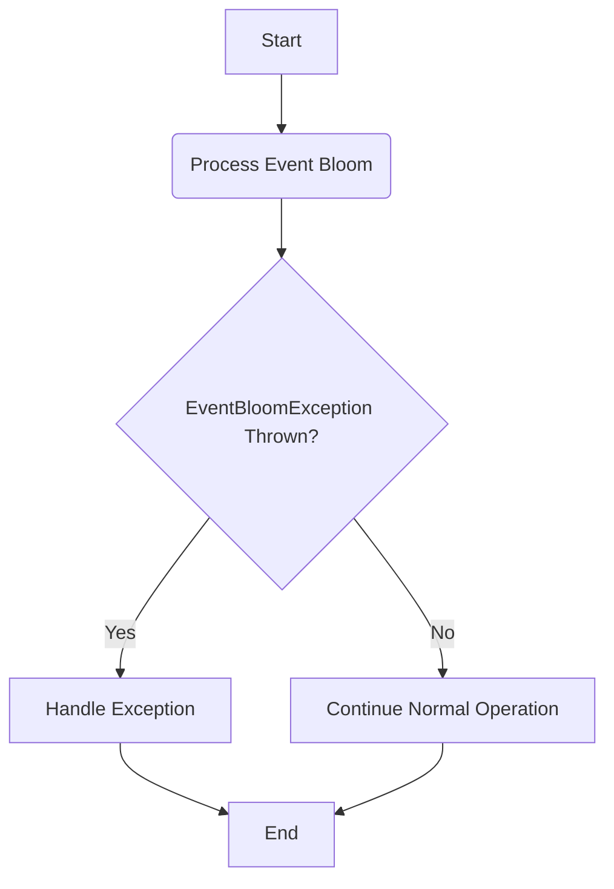

## Module: EventBloomException.java
- **模块名称**: EventBloomException.java

- **主要目标**: 该模块的目的是定义一个特定的异常类型，用于处理与事件Bloom相关的异常情况。在区块链项目Tron中，此异常可能与处理事件日志或事件过滤器时发生的问题有关。

- **关键函数**:
  - `EventBloomException()`: 无参构造函数，创建一个没有详细错误信息的异常实例。
  - `EventBloomException(String message)`: 接受一个字符串参数作为错误信息，用于创建带有详细描述的异常实例。
  - `EventBloomException(String message, Throwable cause)`: 接受一个错误信息和一个Throwable作为原因，用于创建一个既包含错误信息又包含原始异常信息的异常实例。

- **关键变量**: 由于这是一个异常类，主要的“变量”是传递给构造函数的消息（`message`）和原因（`cause`）。

- **依赖性**: 作为`TronException`的子类，`EventBloomException`依赖于其父类来实现基本的异常处理功能。此外，它可能与那些生成或捕获此异常的系统组件有交互。

- **核心与辅助操作**: 核心操作是通过构造函数初始化异常实例。没有明显的辅助操作，因为该类主要聚焦于异常的表示。

- **操作顺序**: 在遇到处理事件Bloom时的错误或异常情况时，可以通过构造一个`EventBloomException`实例来抛出或传递异常信息。

- **性能考虑**: 异常处理机制本身对性能有一定影响，但是作为异常类，`EventBloomException`的性能考虑主要集中在如何有效地创建和处理这些异常实例上。在设计异常处理逻辑时，应注意避免不必要的异常抛出，以减少性能负担。

- **可重用性**: 作为一个特定的异常类，`EventBloomException`的可重用性主要在于它可以在处理Tron区块链事件Bloom相关的不同场景中被重复使用。

- **使用方式**: 在Tron区块链项目的代码中，当遇到与事件Bloom处理相关的错误或异常条件时，可以通过抛出`EventBloomException`来处理这些情况。

- **假设**: 在设计`EventBloomException`时，假设开发者熟悉Java的异常处理机制，并且理解Tron区块链中事件Bloom处理的上下文。此外，假设该异常将在适当的异常捕获和处理机制中使用。
## Flow Diagram [via mermaid]

