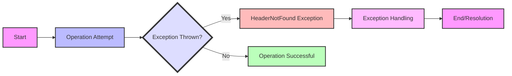

## Module: HeaderNotFound.java
由于原始问题中未提供具体的代码实现细节，以下分析基于提供的模块信息进行推断和概括。请注意，实际分析可能需要更多细节以提供准确的见解。

- **模块名称**：HeaderNotFound.java

- **主要目标**：该模块的目的是定义一个特定的异常，即在特定情况下，当预期的头信息在存储系统中未找到时抛出的异常。这是在处理数据存储和访问操作中常见的异常情形。

- **关键函数**：
  - `HeaderNotFound()`：一个无参构造函数，创建一个基本的`HeaderNotFound`异常实例，不包含额外的错误消息。
  - `HeaderNotFound(String message)`：带有一个字符串参数的构造函数，允许在创建异常实例时附带一个详细的错误消息。

- **关键变量**：由于这是一个异常类，主要的变量可能是继承自`StoreException`或`Exception`的内部结构，用于存储错误消息等信息。

- **相互依赖性**：`HeaderNotFound`继承自`StoreException`，这表明它是特定于存储操作的异常类型的一部分，可能与数据存储和访问的其他组件有关联。

- **核心与辅助操作**：在这个上下文中，定义和抛出异常本身是核心操作。辅助操作可能包括异常的日志记录、异常消息的国际化处理等，但这些通常在异常处理逻辑之外进行。

- **操作序列**：通常，当在数据存储操作中遇到预期的头信息缺失时，将抛出`HeaderNotFound`异常。这通常是在数据访问层的某个点发生的。

- **性能方面**：异常处理通常与性能考虑相关，因为频繁的异常抛出和捕获可能会对应用程序性能产生负面影响。设计良好的异常处理策略可以帮助缓解这些问题。

- **可重用性**：作为一个专门的异常类，`HeaderNotFound`的可重用性主要在于它可以在任何需要此类异常表示的上下文中重用，尤其是在处理类似的数据存储问题时。

- **使用**：`HeaderNotFound`异常可能在数据存储和访问操作中使用，尤其是在需要通知调用者头信息未找到的情况下。

- **假设**：实现这个异常类的一个假设可能是头信息的存在对于某些操作是必需的，且其缺失是一个异常情况，需要特别处理。

请注意，这个分析基于对异常类的一般理解和提供的信息进行推断，没有具体的应用上下文或代码实现细节。
## Flow Diagram [via mermaid]

