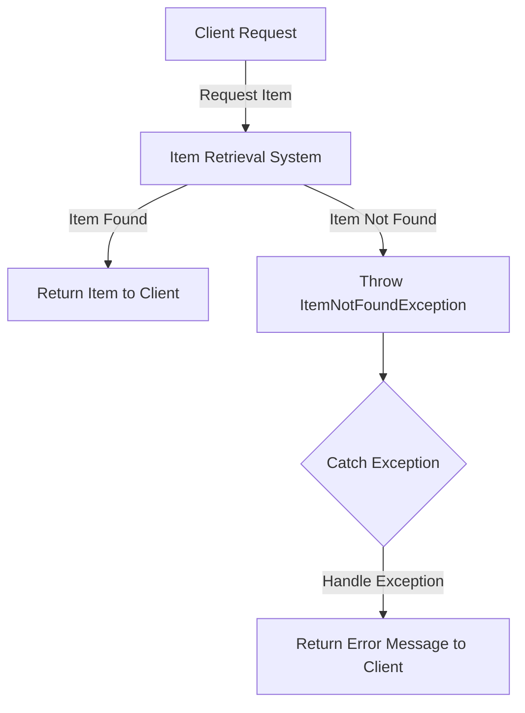

## Module: ItemNotFoundException.java
- **模块名称**：ItemNotFoundException.java
- **主要目的**：该模块的目的是定义一个特定的异常，用于处理在存储操作中未找到项目时抛出的情况。这是一个自定义异常类，继承自StoreException，用于指示在数据访问层中查找特定项失败的情况。
- **关键函数**：
  - `ItemNotFoundException(String message)`：构造函数，接受一个字符串参数作为异常消息。
  - `ItemNotFoundException()`：无参构造函数，调用父类的构造函数。
  - `ItemNotFoundException(String message, Throwable cause)`：构造函数，接受一个字符串作为异常消息和一个Throwable作为原因（即导致异常的底层异常）。
- **关键变量**：无特定变量，主要是构造函数中的参数`message`和`cause`。
- **交互依赖**：该异常类依赖于其父类`StoreException`，后者可能是一个更通用的异常类，用于表示存储操作中的错误。
- **核心与辅助操作**：其核心操作是提供足够的信息（通过消息和原因）来标识和解释异常情况。没有明确的辅助操作。
- **操作序列**：通常，在尝试从存储中检索不存在的项时，会创建并抛出`ItemNotFoundException`实例。
- **性能方面**：作为一个异常类，其性能影响主要在于创建异常对象和堆栈跟踪的开销。在性能敏感的应用中，应谨慎使用异常。
- **可重用性**：由于是专门针对未找到存储项的情况设计的异常，其可重用性主要限于类似的数据访问场景。
- **使用**：在数据访问层中，当尝试访问或操作一个不存在的项时，可以抛出`ItemNotFoundException`，以提供清晰的错误信息。
- **假设**：该模块假设所有的存储操作异常都可以通过继承`StoreException`来统一处理，且存在一个明确的需要区分“项未找到”这一特定情况的场景。

这个分析基于提供的代码模块，旨在帮助理解`ItemNotFoundException.java`模块的设计和用途。
## Flow Diagram [via mermaid]

