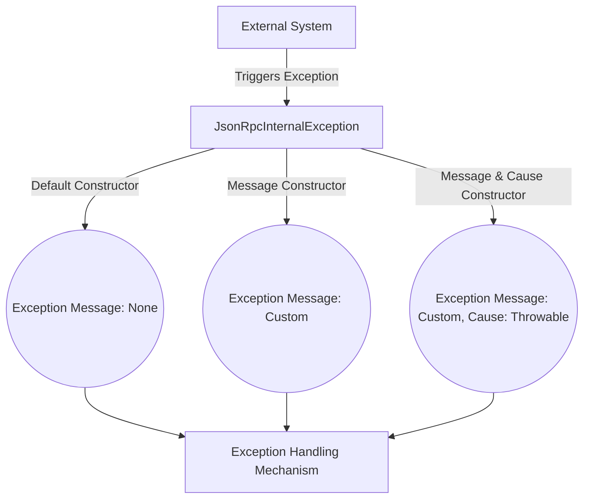

## Module: JsonRpcInternalException.java
- **模块名称**：JsonRpcInternalException.java

- **主要目标**：该模块的目的是定义一个特定的异常类型——JsonRpcInternalException，它用于处理在Tron区块链平台中与JSON RPC相关的内部异常情况。

- **关键功能**：
  - `JsonRpcInternalException()`：一个无参构造函数，用于创建一个基本的异常实例。
  - `JsonRpcInternalException(String message)`：此构造函数接受一个字符串参数，用于指定异常的具体消息。
  - `JsonRpcInternalException(String message, Throwable cause)`：此构造函数接受一个字符串和一个Throwable，允许指定异常的消息和原因。

- **关键变量**：无直接变量，但构造函数参数`message`和`cause`是关键信息载体。

- **相互依赖性**：作为TronException的子类，它与Tron的异常处理系统紧密相关，可能会与处理JSON RPC请求的其他系统组件交互。

- **核心与辅助操作**：其核心操作是提供异常信息的封装和传递。没有明显的辅助操作。

- **操作顺序**：通常，在检测到与JSON RPC相关的内部错误时抛出此异常，以通知调用者存在问题。

- **性能方面**：作为异常类，其性能影响主要在于异常创建和抛出的开销，这在大多数情况下是可接受的，但应避免在频繁执行路径中不必要地抛出异常。

- **可重用性**：由于它是针对特定于Tron平台的JSON RPC错误设计的，其可重用性可能主要局限于Tron或类似的区块链项目中。

- **用途**：在Tron区块链平台的开发中，当遇到内部处理JSON RPC请求时的错误或异常情况，使用此异常类来处理和传递错误信息。

- **假设**：使用此异常类的前提假设包括认为所有与JSON RPC相关的内部错误都应该通过抛出此类型的异常来处理。此外，假设调用者能够妥善处理或响应这些异常。

这个分析提供了对JsonRpcInternalException模块的一个全面概述，从其目的和关键功能到性能考虑和使用场景。
## Flow Diagram [via mermaid]

