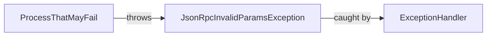

## Module: JsonRpcInvalidParamsException.java
- **模块名称**：JsonRpcInvalidParamsException.java

- **主要目标**：该模块的目的是定义一个特定的异常，用于处理JSON RPC请求中的无效参数错误。这是在进行基于JSON RPC的通信时，对参数验证失败或错误进行反馈的一种方式。

- **关键功能**：
  - `JsonRpcInvalidParamsException()`：一个无参构造方法，创建一个基本的异常实例。
  - `JsonRpcInvalidParamsException(String msg)`：接受一个字符串参数的构造方法，用于创建带有特定错误信息的异常实例。
  - `JsonRpcInvalidParamsException(String message, Throwable cause)`：接受一个错误信息和一个Throwable原因的构造方法，用于创建一个包含详细错误信息和原始异常原因的异常实例。

- **关键变量**：无直接变量，但构造方法参数（如`msg`和`cause`）是关键信息载体。

- **相互依赖性**：该异常类继承自`TronException`，说明它是Tron项目中异常处理体系的一部分。它与系统中处理JSON RPC请求的其他组件相互作用，尤其是在参数验证失败时被抛出。

- **核心与辅助操作**：该模块的核心操作是提供不同的构造方法以支持异常的创建和初始化。没有明显的辅助操作，所有构造方法都直接关联到异常的创建和信息传递。

- **操作序列**：在实际使用中，当JSON RPC请求的参数验证失败时，根据错误的具体情况，可以通过调用相应的构造方法创建并抛出`JsonRpcInvalidParamsException`实例。

- **性能方面**：作为一个异常类，其性能影响主要取决于它被创建和抛出的频率。频繁地抛出异常可能会对应用程序的性能产生负面影响。

- **可重用性**：由于该异常类是针对特定的错误情况（即JSON RPC请求中的无效参数）设计的，它的可重用性主要限于处理类似错误的上下文中。

- **使用**：在处理JSON RPC请求并对参数进行验证时，如果发现参数无效或不符合预期，可以使用此异常类来通知调用者具体的错误情况。

- **假设**：在设计此异常类时，假设了JSON RPC请求的参数需要进行验证，且存在无效参数的可能性。此外，还假设了异常处理机制能够妥善地捕获和处理这些异常，以向用户反馈有用的错误信息。
## Flow Diagram [via mermaid]

