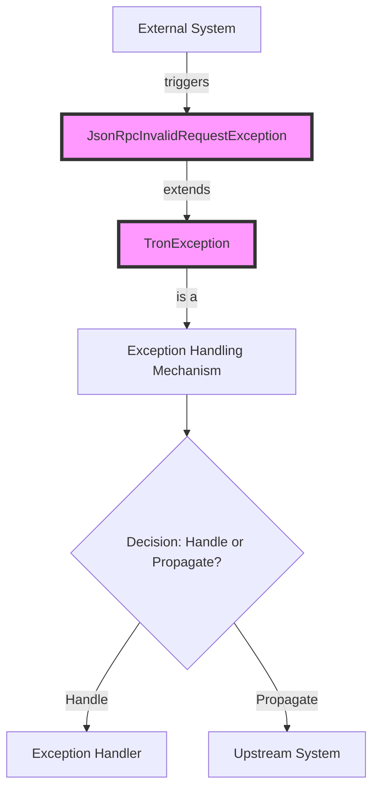

## Module: JsonRpcInvalidRequestException.java
- **模块名称**：JsonRpcInvalidRequestException.java
- **主要目标**：定义用于处理JSON RPC无效请求异常的类。其目的是在遇到无效的JSON RPC请求时提供一个明确的异常类型，以便更好地捕获和处理这类错误。
- **关键功能**：
  - `JsonRpcInvalidRequestException()`：一个无参构造方法，创建一个基本的异常实例。
  - `JsonRpcInvalidRequestException(String message)`：接受一个字符串参数的构造方法，允许在创建异常时附加自定义消息。
  - `JsonRpcInvalidRequestException(String message, Throwable cause)`：允许同时传递错误消息和导致异常的原因（另一个异常），提供更多上下文的构造方法。
- **关键变量**：无特定的变量，因为这个类主要是扩展了`TronException`类并提供构造方法。
- **交互依赖**：作为`TronException`的子类，它继承了父类的所有属性和方法，依赖于Java的异常处理机制。
- **核心与辅助操作**：该模块的核心操作是提供构造方法以支持不同类型的异常信息和原因。没有明显的辅助操作。
- **操作序列**：通常，当JSON RPC请求解析失败或请求格式不正确时，会抛出此异常。它的使用依赖于外部调用者捕获和处理这个异常。
- **性能方面**：作为一个异常类，其性能影响主要取决于它被抛出和捕获的频率。异常处理通常比正常控制流程更耗时，因此应避免在正常操作中频繁抛出异常。
- **可重用性**：这个类是为特定的异常情况设计的，但由于其继承自`TronException`，它可以在需要处理类似JSON RPC请求无效的场景中复用。
- **使用**：在处理JSON RPC请求的代码中，当检测到请求无效时（例如，格式错误或缺少必要信息），可以抛出此异常。
- **假设**：该类的设计假设了异常情况是由于无效的JSON RPC请求引起的，这意味着在抛出此异常之前，应有一定的逻辑来判断请求是否有效。
## Flow Diagram [via mermaid]

