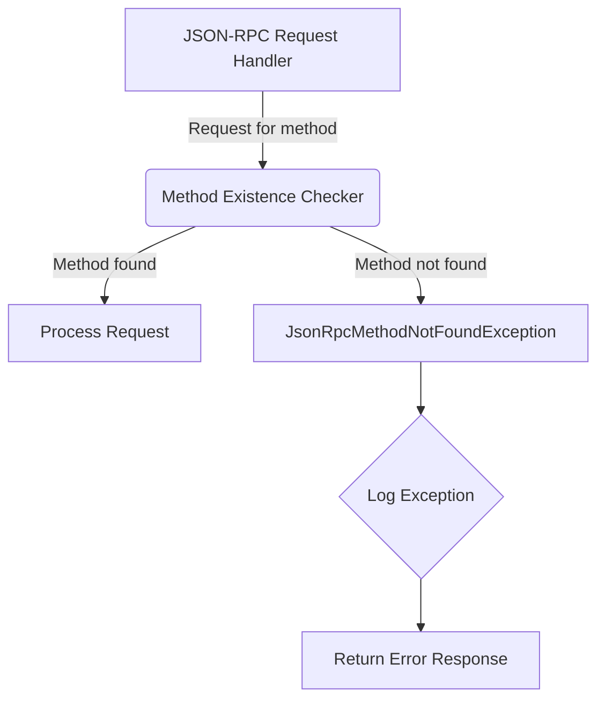

## Module: JsonRpcMethodNotFoundException.java
- **模块名称**：JsonRpcMethodNotFoundException.java

- **主要目标**：该模块的目的是定义一个特定的异常，用于处理在TRON区块链平台上使用JSON RPC接口时，请求的方法未找到的情况。

- **关键功能**：
  - `JsonRpcMethodNotFoundException()`：一个无参构造函数，创建一个基本的异常实例。
  - `JsonRpcMethodNotFoundException(String msg)`：接受一个字符串消息作为参数的构造函数，创建一个带有特定错误信息的异常实例。
  - `JsonRpcMethodNotFoundException(String message, Throwable cause)`：接受一个错误消息和一个Throwable原因作为参数的构造函数，创建一个带有详细错误信息和原因的异常实例。

- **关键变量**：由于这是一个异常类，其主要变量是继承自父类（`TronException`或更高级别的异常类）的消息字符串和原因（`Throwable`）。

- **互依赖性**：该模块依赖于它的父类`TronException`，后者是一个更通用的异常类，用于TRON区块链平台的异常处理。此外，它可能与JSON RPC接口处理系统中的其他组件交互，尤其是在异常捕获和处理机制中。

- **核心与辅助操作**：此类的核心操作是提供不同的构造函数来创建异常实例。辅助操作可能包括与异常处理和日志记录相关的操作，但这些通常是在异常类之外进行的。

- **操作序列**：在JSON RPC方法查找失败时，此异常会被抛出。操作序列通常开始于JSON RPC请求的接收，随后是方法查找；如果未找到相应的方法，则抛出`JsonRpcMethodNotFoundException`。

- **性能方面**：作为一个异常类，其性能影响主要在于异常创建和抛出的开销。在高性能的环境中，频繁地抛出异常可能会影响总体性能。

- **可重用性**：由于这是一个特定于TRON区块链平台和JSON RPC方法未找到情况的异常类，其可重用性可能相对有限，主要限于类似的上下文或框架中。

- **使用**：当TRON区块链平台的JSON RPC接口接收到一个请求，但无法在其方法库中找到对应的处理方法时，会使用此异常类。

- **假设**：使用此异常类的一个基本假设是，所有的JSON RPC方法请求都应该能够在系统中找到对应的处理方法。如果一个方法请求没有对应的处理逻辑，那么这是一个异常情况，应该通过抛出`JsonRpcMethodNotFoundException`来处理。
## Flow Diagram [via mermaid]

