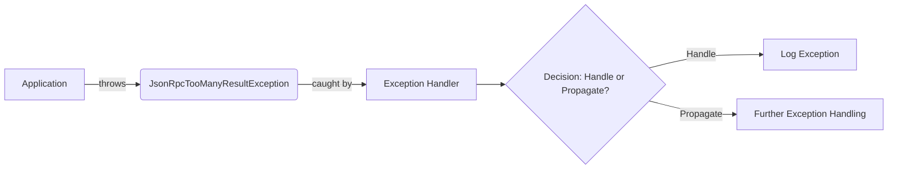

## Module: JsonRpcTooManyResultException.java
- **模块名称**: JsonRpcTooManyResultException.java

- **主要目标**: 该模块的目的是定义一个特定的异常，用于处理在使用JSON RPC通信时返回结果过多的情况。它扩展了TronException，表明这是Tron项目中特定的异常情况。

- **关键函数**:
  - `JsonRpcTooManyResultException()`: 无参构造函数，用于创建异常实例而不传递任何消息。
  - `JsonRpcTooManyResultException(String message)`: 接收一个字符串消息作为参数，用于提供关于异常的详细信息。
  - `JsonRpcTooManyResultException(String message, Throwable cause)`: 接收一个字符串消息和一个Throwable原因作为参数，旨在提供异常的详细信息以及引发异常的原因。

- **关键变量**: 由于这是一个异常类，其主要变量是继承自父类的消息和原因，用于描述异常的详情。

- **相互依赖性**: 该模块依赖于TronException类，因为它是从TronException继承而来。这意味着它也间接依赖于Java的Exception类体系。

- **核心与辅助操作**: 核心操作是异常的构造和信息传递机制，而没有明确的辅助操作。

- **操作序列**: 在这个异常类中，没有特定的操作序列。异常的抛出和处理遵循Java异常处理的标准流程。

- **性能方面**: 作为一个异常类，其对性能的影响主要在于异常的创建和抛出过程。通常，异常处理不应该是常规控制流程中频繁执行的操作，因此它的性能影响应该是有限的。

- **可重用性**: 异常类通常具有较高的可重用性，因为它们可以在多种场景下表示特定类型的错误。此异常类可以在任何需要处理JSON RPC结果过多情况的Tron项目部分中重用。

- **使用**: 该异常类用于在处理JSON RPC请求并且返回的结果超出预期或限制时，通过抛出异常的方式来通知调用者。

- **假设**: 
  - 假设在Tron项目中使用JSON RPC进行通信。
  - 假设存在结果数量超出特定限制或预期的情况，需要特别处理。

通过定义这样一个专门的异常类，开发者可以更精确地控制和处理特定的错误情况，从而提高代码的可读性和维护性。
## Flow Diagram [via mermaid]

