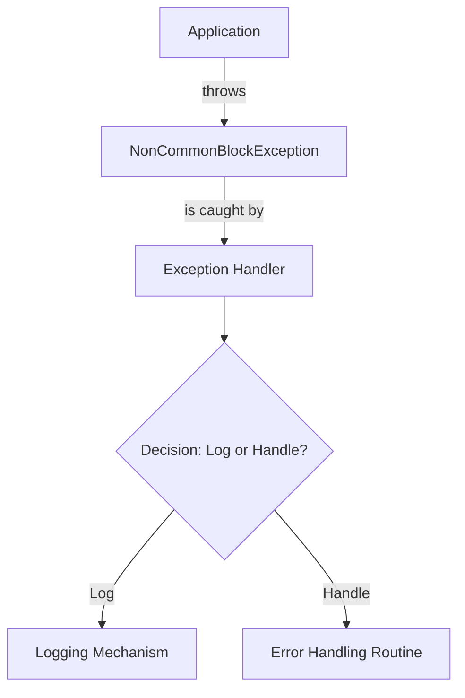

## Module: NonCommonBlockException.java
- **模块名称**：NonCommonBlockException.java

- **主要目标**：该模块的目的是定义一个特定的异常类型——NonCommonBlockException，用于处理Tron区块链平台中非共同区块的异常情况。这种异常通常在区块链节点之间同步数据时，发现不匹配的区块时抛出。

- **关键函数**：
  - `NonCommonBlockException()`：一个无参构造函数，创建一个基本的异常实例。
  - `NonCommonBlockException(String message)`：带有详细错误信息的构造函数，用于创建包含特定错误描述的异常实例。
  - `NonCommonBlockException(String message, Throwable cause)`：带有详细错误信息和引起异常的原因的构造函数，用于创建包含错误描述和原因的异常实例。

- **关键变量**：该模块没有明显的关键变量，因为它主要定义了几种构造函数。

- **相互依赖性**：作为Tron区块链平台异常处理机制的一部分，NonCommonBlockException可能会与区块链数据同步或验证过程中的其他组件交互，但该模块本身主要独立于其他系统组件。

- **核心与辅助操作**：该模块的核心操作是提供异常类型的定义。没有明显的辅助操作。

- **操作序列**：在数据同步或验证过程中，当遇到非共同区块的情况时，可能会抛出NonCommonBlockException异常。

- **性能方面**：作为一个异常类，NonCommonBlockException本身对性能的影响较小，但异常处理的方式可能会影响整体应用性能。

- **可重用性**：由于该异常类是针对特定情况（非共同区块）设计的，其可重用性主要限于Tron区块链平台或类似的区块链系统中处理类似异常的场景。

- **使用**：在Tron区块链平台的代码中，当节点在同步或验证区块链数据时遇到不匹配的区块，可以抛出NonCommonBlockException来标识和处理这种特定的异常情况。

- **假设**：该模块的设计假设是，在区块链系统中，存在需要特别处理的非共同区块的情况。它假设调用者了解如何恰当地捕获和处理这种异常。
## Flow Diagram [via mermaid]

