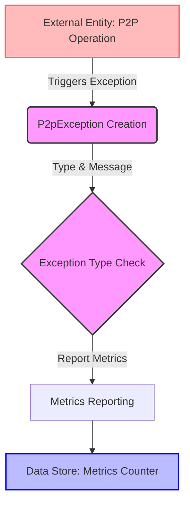

## Module: P2pException.java
- **模块名称**：P2pException.java

- **主要目标**：定义一个专门用于处理P2P网络中发生的异常的类。这个类扩展了Java的Exception类，使其能够更具体地处理与P2P网络相关的错误情况。

- **关键功能**：
  - 构造函数：根据异常类型、错误消息和可选的Throwable对象来创建异常实例。
  - `report()`方法：当异常被创建时，此方法会被调用，用于上报异常信息到监控系统。
  - `getType()`方法：返回异常的类型。

- **关键变量**：
  - `type`：TypeEnum类型，表示异常的具体类型。

- **相互依赖**：
  - 与监控系统的依赖：通过`report()`方法与监控系统（如Prometheus）交互，上报异常情况。
  - 与`TypeEnum`的依赖：使用枚举来定义和管理不同的异常类型。

- **核心与辅助操作**：
  - 核心操作：异常类型的定义、异常信息的构造和异常的上报。
  - 辅助操作：提供异常类型的描述和值的获取方法。

- **操作序列**：
  1. 实例化P2pException对象时，根据提供的异常类型、错误信息和可选的Throwable对象初始化。
  2. 调用`report()`方法，将异常信息上报到监控系统。
  3. 通过`getType()`方法可以获取异常的类型。

- **性能方面**：
  - 异常处理和上报的性能影响：异常的创建和上报可能会引入额外的性能开销，特别是在高频异常发生场景下。

- **可重用性**：
  - 由于这个类专门处理P2P网络中的异常，其重用性可能受限于需要处理P2P相关异常的应用场景。

- **使用**：
  - 在P2P网络操作中，当遇到预定义的异常情况时，可以创建并抛出`P2pException`，同时异常信息会被上报到监控系统，便于问题的追踪和定位。

- **假设**：
  - 假设有一个可靠的监控系统能够接收和处理上报的异常信息。
  - 假设P2P网络操作中可能遇到的异常情况已经被充分定义和覆盖。
## Flow Diagram [via mermaid]

