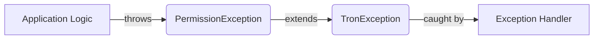

## Module: PermissionException.java
- **模块名称**：PermissionException.java
- **主要目的**：该模块的目的是定义一个特定的异常类型——PermissionException，用于处理Tron区块链平台中与权限相关的异常情况。
- **关键函数**：
  - `PermissionException()`：一个无参构造函数，用于创建一个没有详细错误信息的PermissionException实例。
  - `PermissionException(String message)`：带有详细错误信息的构造函数，允许在创建PermissionException实例时提供具体的异常信息。
- **关键变量**：没有明确的变量，但构造函数中的`message`参数是关键，因为它传达了异常的具体信息。
- **相互依赖性**：作为Tron区块链平台异常处理体系的一部分，PermissionException可能与处理异常的其他组件（如日志记录、异常捕获和处理机制）有交互。
- **核心与辅助操作**：在这个模块中，定义异常类型本身是核心操作。没有明显的辅助操作。
- **操作序列**：由于这是一个异常类，它的“操作序列”主要涉及到被抛出和被捕获处理的流程，而不是传统意义上的操作序列。
- **性能方面**：作为一个异常类，性能考虑主要集中在异常创建和抛出的开销上。通常，异常处理机制的性能影响较小，除非异常在系统中频繁抛出。
- **可重用性**：PermissionException作为一个特定于权限问题的异常类，其重用性主要在于Tron区块链平台或需要处理类似权限异常的系统中。
- **使用**：当Tron区块链平台的某个操作因为权限不足而不能执行时，可以抛出PermissionException来通知调用者存在权限问题。
- **假设**：该模块假设使用者熟悉Java异常处理机制。此外，它还假设在Tron区块链平台中存在一套权限管理机制，当操作违反这些权限时，需要通过抛出异常来处理。
## Flow Diagram [via mermaid]

