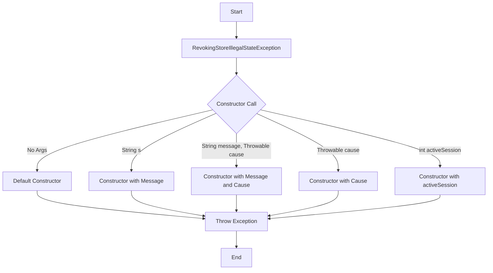

## Module: RevokingStoreIllegalStateException.java
- **模块名称**：RevokingStoreIllegalStateException.java

- **主要目标**：定义一个特定的异常，用于处理撤销存储（Revoking Store）中遇到的非法状态异常。这通常在区块链技术或相关系统中，当撤销存储的状态不符合预期时抛出。

- **关键函数**：
  - `RevokingStoreIllegalStateException()`：无参数构造函数，创建一个没有详细消息的异常。
  - `RevokingStoreIllegalStateException(String s)`：带有详细消息的构造函数，创建一个包含特定详细信息的异常。
  - `RevokingStoreIllegalStateException(String message, Throwable cause)`：构造一个新的异常，带有详细消息和原因。
  - `RevokingStoreIllegalStateException(Throwable cause)`：构造一个新的异常，仅带有原因。
  - `RevokingStoreIllegalStateException(int activeSession)`：特定用途的构造函数，用于在活动会话数量不合法时抛出异常。

- **关键变量**：`serialVersionUID`：用于异常类的序列化。

- **相互依赖性**：此异常类可能与系统中管理撤销操作的其他组件相互作用，尤其是在处理状态不一致或操作失败时。

- **核心与辅助操作**：核心操作是提供不同构造函数以支持多种异常抛出场景。辅助操作包括与其他系统组件的交互，尤其是异常处理机制。

- **操作序列**：通常，当撤销存储的状态检查失败或遇到非法状态时，将抛出此异常。它标识了一个特定的错误流程，需要开发者或系统管理员关注并处理。

- **性能方面**：作为一个异常类，其性能影响主要在于异常创建和抛出的开销。在高性能系统中，频繁抛出异常可能会影响总体性能。

- **可重用性**：此异常类设计为可重用，可在系统中任何遇到撤销存储非法状态的地方抛出。

- **使用**：在撤销存储操作中，当检测到非法状态或操作失败时，通过抛出此异常来通知调用者问题的存在。

- **假设**：在设计此异常类时，假设系统中存在一个或多个撤销存储机制，且这些机制的状态管理是正确和必要的。同时假设调用者能够妥善处理或响应此异常。
## Flow Diagram [via mermaid]

